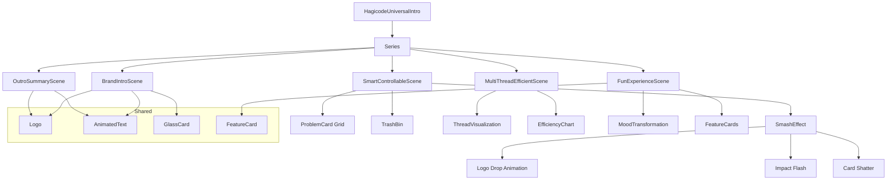

# Design Document: Hagicode Universal Intro Video

## Context

This document describes the technical design for creating a universal intro video composition for Hagicode. The intro video will serve as a standardized opening for product promotional content, showcasing how Hagicode eliminates common AI development problems.

### Constraints

- **Total Duration**: 7 seconds (420 frames @ 60fps)
- **Canvas Size**: 1920x1080 (Full HD landscape)
- **Frame Rate**: 60 fps for smooth animation
- **Framework**: Remotion 4.0 with React 19 and TypeScript
- **Deterministic Rendering**: All animations must use seeded randomness
- **Theme Consistency**: Must match existing `src/utils/theme.ts` design system

### Stakeholders

- **Content Team**: Needs reusable intro template for multiple videos
- **Marketing Team**: Requires clear value proposition communication
- **Development Team**: Needs maintainable, component-based architecture

## Goals / Non-Goals

### Goals

1. Create a visually compelling 7-second intro showing Hagicode solving AI development problems
2. Build reusable visualization components for future video content
3. Establish a consistent brand opening for all Hagicode promotional videos
4. Use impactful "smash" animation to demonstrate problem elimination

### Non-Goals

- Audio/sound design (can be added separately)
- Multi-language support (Chinese only for initial version)
- Interactive elements (this is a rendered video, not a web component)
- Dynamic data-driven content (static content is sufficient)

## Decisions

### Decision 1: Scene-Based Architecture

**Choice**: Use `<Series>` with sequential `<Series.Sequence>` for scene progression.

**Rationale**:
- Linear storytelling matches the 5-act structure defined in requirements
- Clear separation of concerns (each scene is a focused component)
- Easier to test individual scenes in isolation
- Consistent with existing `HagicodeUpdateBulletin` pattern

**Alternatives Considered**:
- Single component with timeline state management: More complex, harder to test
- Overlapping sequences: Not needed for linear intro format

### Decision 2: Component Reuse Strategy

**Choice**: Create new intro-specific components alongside existing component library.

**Rationale**:
- Intro visualization needs (thread animation, efficiency chart) are specialized
- Existing components (FeatureCard, GlassCard, AnimatedText) can be reused
- Keeps concerns separated (intro vs update bulletin)
- Allows intro-specific optimizations (7-second duration constraint)

**Alternatives Considered**:
- Modify existing components: Risk of breaking update bulletin
- Copy-paste existing components: Duplicates code, harder to maintain

### Decision 3: Animation Timing Distribution

**Choice**: 5 scenes with durations: 60 + 180 + 90 + 60 + 30 = 420 frames (7 seconds @ 60fps).

**Rationale**:
- Scene 1 (brand intro): 60 frames (1 second) for clear brand display
- Scene 2 (smash animation): 180 frames (3 seconds) for the impactful problem elimination sequence
- Scene 3 (multithreading): 90 frames (1.5 seconds) for efficiency visualization
- Scene 4 (fun experience): 60 frames (1 second) for customization and gamification features
- Scene 5 (outro): 30 frames (0.5 seconds) for quick tagline and CTA
- Total 420 frames at 60fps provides smooth, high-quality animation

**Frame Timeline**:
- Scene 1: 0-60 frames (1.0s) - Brand display
- Scene 2: 60-240 frames (3.0s) - Problem grid + smash animation
- Scene 3: 240-330 frames (1.5s) - Multithreading efficiency
- Scene 4: 330-390 frames (1.0s) - Fun experience
- Scene 5: 390-420 frames (0.5s) - Outro
- **Total**: 420 frames (7.0s @ 60fps)

### Decision 4: "Smash" Animation Approach

**Choice**: Use physics-based drop animation with particle effects for debris.

**Rationale**:
- Creates visual impact and memorability
- Clearly communicates "eliminating problems"
- More engaging than simple text transitions
- Reusable components for other "problem elimination" scenarios

**Alternatives Considered**:
- Fade out/fade in: Too subtle, lacks impact
- Swipe/slide: Doesn't convey "destruction" of problems
- Scale down: Doesn't match the "trash" metaphor

## UI/UX Design

### Visual Hierarchy

```
┌─────────────────────────────────────────────────────┐
│                                                     │
│  PRIMARY: Brand/Feature Title (largest)             │
│  SECONDARY: Supporting description (medium)         │
│  TERTIARY: Metrics/CTA links (smallest)             │
│                                                     │
└─────────────────────────────────────────────────────┘
```

### Color Usage

Per `src/utils/theme.ts`:

- **Primary Blue** (#3B82F6): Brand elements, primary actions
- **Secondary Purple** (#8B5CF6): AI/innovation features
- **Success Green** (#10B981): Efficiency improvements, positive metrics
- **Background Dark** (#0F172A): Main canvas background
- **Text Primary** (#F1F5F9): Main text content

### Typography Scale

- Hero titles: 100-120px (brand name)
- Section titles: 52-64px (feature names)
- Body text: 28-36px (descriptions)
- Metrics: 64-80px (numbers like "3x", "5x")

### Animation Principles

1. **Enter animations**: Ease-out (decelerate into position)
2. **Exit animations**: Fade out (no movement, avoids distraction)
3. **Emphasis**: Spring physics for metric numbers
4. **Transitions**: Quick cuts between scenes (no crossfade)

## Technical Design

### Component Architecture

```
src/
├── compositions/
│   └── HagicodeUniversalIntro.tsx    # Main composition entry
├── scenes/intro/
│   ├── BrandIntroScene.tsx           # Scene 1: Brand display
│   ├── SmartControllableScene.tsx    # Scene 2: Problem smash
│   ├── MultiThreadEfficientScene.tsx # Scene 3: Multithreading
│   ├── FunExperienceScene.tsx        # Scene 4: Fun features
│   └── OutroSummaryScene.tsx         # Scene 5: Summary
├── components/intro/
│   ├── ProblemCard.tsx               # Individual problem card
│   ├── SmashEffect.tsx               # Logo drop + impact animation
│   ├── TrashBin.tsx                  # Trash bin with debris collection
│   ├── ThreadVisualization.tsx       # Thread count animation
│   └── EfficiencyChart.tsx           # Percentage bar chart
└── Root.tsx                          # Register composition
```

### Data Flow



### State Management

No external state needed. Each scene:
- Receives `delay` prop for animation timing
- Uses `useCurrentFrame()` hook for animation progression
- All content is static (no props schema)

### Animation Utilities

```typescript
// Common animation patterns (reusable)

// Fade in with slide
const fadeInSlide = (frame: number, delay: number) => {
  const progress = interpolate(frame, [delay, delay + 20], [0, 1], {
    extrapolateRight: 'clamp',
  });
  const translateY = interpolate(progress, [0, 1], [30, 0]);
  return { opacity: progress, transform: `translateY(${translateY}px)` };
};

// Counter animation for numbers
const counterValue = (frame: number, start: number, end: number, duration: number) => {
  return interpolate(frame, [0, duration], [start, end], {
    extrapolateRight: 'clamp',
  });
};

// Spring scale effect
const springScale = (frame: number, delay: number) => {
  return spring({
    frame: frame - delay,
    fps: 30,
    config: { stiffness: 100, damping: 10 },
  });
};
```

### Frame Calculation Reference

```typescript
// DURATION_IN_FRAMES = 420 (7 seconds @ 60fps)

// Scene timeline
const TIMELINE = {
  scene1: { from: 0, duration: 60 },      // 0-60 frames
  scene2: { from: 60, duration: 180 },    // 60-240 frames
  scene3: { from: 240, duration: 90 },    // 240-330 frames
  scene4: { from: 330, duration: 60 },    // 330-390 frames
  scene5: { from: 390, duration: 30 },    // 390-420 frames
} as const;
```

## Scene-Specific Designs

### Scene 1: BrandIntroScene

**Layout**: Centered logo with text below

```tsx
<AbsoluteFill style={{ justifyContent: 'center', alignItems: 'center' }}>
  <Logo size={100} />
  <AnimatedText text="Hagicode" effect="slide" delay={0} />
  <AnimatedText text="AI 开发助手" effect="fade" delay={20} />
  <div style={{ marginTop: 40 }}>
    <Text style={{ fontSize: 24 }}>github.com/hagicode</Text>
  </div>
</AbsoluteFill>
```

**Key Frames** (@ 60fps):
- 0-20: Logo fade-in + scale
- 20-40: "Hagicode" slide-in
- 40-60: "AI 开发助手" fade-in

### Scene 2: SmartControllableScene (The Smash Animation)

**Layout**: Problem grid + Hagicode drop + trash bin

```tsx
<AbsoluteFill>
  {/* Problem Card Grid - displays frames 0-30 */}
  <ProblemGrid
    problems={[
      'AI 经常返工',
      'AI 意外修改了不在范围内的文件',
      'AI 无法理解项目结构',
      'AI 产生了幻觉',
      'AI 没有正确的验收结果',
      'AI 总是听不懂人话',
    ]}
    visibleUntil={30}
  />

  {/* Hagicode Logo Drop - frames 30-60 */}
  <SmashEffect
    triggerFrame={30}
    impactFrame={60}
  />

  {/* Debris Animation - frames 60-90 */}
  <DebrisField
    from={60}
    to={90}
    targetPosition={{ x: 960, y: 900 }}
  />

  {/* Trash Bin - frames 0-180 */}
  <TrashBin
    position={{ x: 960, y: 950 }}
    collectFrom={90}
    lidCloseAt={150}
  />
</AbsoluteFill>
```

**Animation Sequence** (@ 60fps):
- **Frames 0-30**: Problem cards fade in and display (6 cards in 3x2 grid)
- **Frames 30-60**: Hagicode logo drops from top of screen, accelerates with gravity
- **Frame 60**: Impact moment - white flash, cards begin to shatter
- **Frames 60-90**: Card pieces and debris fly toward trash bin with physics arcs
- **Frames 90-150**: Debris enters trash bin, bin fills visually
- **Frames 150-180**: Trash bin lid closes, success indicator appears

### Scene 3: MultiThreadEfficientScene

**Layout**: Split view (threads left, chart right)

```tsx
<AbsoluteFill>
  <div style={{ display: 'grid', gridTemplateColumns: '1fr 1fr' }}>
    <ThreadVisualization
      threadCount={interpolate(frame, [0, 45], [1, 5])}
      delay={0}
    />
    <EfficiencyChart
      percentage={interpolate(frame, [0, 45], [20, 100])}
      delay={0}
    />
  </div>
  <MetricDisplay
    value="5x"
    label="效能提升"
    delay={45}
  />
</AbsoluteFill>
```

**Key Frames** (@ 60fps):
- 0-45: Thread count animates from 1 to 5
- 0-45: Efficiency chart animates from 20% to 100%
- 45-90: Metric text displays

### Scene 4: FunExperienceScene

**Layout**: Mood transformation + feature grid

```tsx
<AbsoluteFill>
  <MoodTransformation from="bored" to="happy" delay={0} />
  <FeatureGrid
    features={[
      { icon: 'palette', text: '丰富的主题定制' },
      { icon: 'music', text: '丰富的音效定制' },
      { icon: 'sparkles', text: '丰富的样式定制' },
      { icon: 'trophy', text: '有趣的成就系统' },
      { icon: 'file-text', text: '明确的历史简报' },
      { icon: 'history', text: '历史详细情况记录' },
    ]}
    delay={15}
  />
</AbsoluteFill>
```

**Key Frames** (@ 60fps):
- 0-20: Mood transformation animation (bored → happy)
- 20-60: Feature cards fade in

### Scene 5: OutroSummaryScene

**Layout**: Centered summary

```tsx
<AbsoluteFill>
  <Logo size={60} />
  <Text style={{ fontSize: 48, fontWeight: 'bold' }}>Hagicode</Text>
  <FeatureList
    features={[
      { text: '智能可控', highlight: '消除 AI 开发常见问题' },
      { text: '高效多线程', highlight: '效能提升 5 倍' },
      { text: '有趣体验', highlight: '定制化与成就系统' },
    ]}
  />
  <CTALink url="github.com/hagicode" />
</AbsoluteFill>
```

**Key Frames** (@ 60fps):
- 0-30: All elements fade in simultaneously

## Component Specifications

### ProblemCard

**Purpose**: Display individual AI development problem in a glass card

**Props**:
```typescript
interface ProblemCardProps {
  text: string;           // Problem text (1-2 lines)
  index: number;          // Card index (0-5)
  delay?: number;         // Fade-in delay
  visibleUntil?: number;  // Frame when card should shatter
}
```

**Visual**:
- Glass morphism card (semi-transparent with blur)
- Warning/error color accent (red/orange)
- Compact size for 3x2 grid layout
- Disappears/smashes at `visibleUntil` frame

### SmashEffect

**Purpose**: Orchestrate the logo drop and impact animation

**Props**:
```typescript
interface SmashEffectProps {
  triggerFrame: number;   // When logo starts dropping
  impactFrame: number;    // When impact occurs
}
```

**Animation**:
- Logo enters from top (y: -100 to y: center)
- Accelerates using gravity simulation
- Impact flash (white overlay, opacity 1 → 0)
- Triggers card shatter animations

### TrashBin

**Purpose**: Collect debris and show completion

**Props**:
```typescript
interface TrashBinProps {
  position: { x: number; y: number };
  collectFrom: number;    // Frame when debris starts arriving
  lidCloseAt: number;     // Frame when lid closes
}
```

**Visual**:
- Large trash can icon/emoji at bottom center
- Lid rotates closed at specified frame
- Success checkmark appears when complete
- Optional "solved" text

### ThreadVisualization

**Purpose**: Animated display of thread count (1 → 5)

**Props**:
```typescript
interface ThreadVisualizationProps {
  threadCount: number;  // Current count (1-5, interpolated)
  delay?: number;
  maxThreads?: number;  // Default: 5
}
```

**Visual**:
- Row of circular nodes
- Each node represents a thread
- Active threads: Blue glow
- Inactive threads: Dimmed

### EfficiencyChart

**Purpose**: Animated bar chart (20% → 100%)

**Props**:
```typescript
interface EfficiencyChartProps {
  percentage: number;  // Current percentage (20-100, interpolated)
  delay?: number;
  showLabel?: boolean;
}
```

**Visual**:
- Vertical bar fills from bottom
- Color gradient (red → yellow → green)
- Percentage label above bar

## Risks / Trade-offs

### Risk 1: Animation Complexity

**Risk**: Smash animation with debris physics may be complex to implement.

**Mitigation**:
- Use simple particle system for debris (not full physics)
- Pre-calculate debris paths using deterministic math
- Test Scene 2 in isolation first
- 300 frames (5 seconds) provides adequate time for the full sequence

### Risk 2: Visual Clutter with 6 Problem Cards

**Risk**: Too many cards may make text unreadable.

**Mitigation**:
- Use compact card design with minimal text
- Large canvas (1920x1080) provides adequate space
- Consider reducing to 4 problems if readability is an issue
- Test at 50% scale to simulate smaller screens

### Risk 3: Debris Animation Performance

**Risk**: Many moving particles could cause rendering issues.

**Mitigation**:
- Limit debris particles to ~30-40 total
- Use CSS transforms (GPU accelerated)
- Avoid complex per-particle calculations
- Use seeded random for deterministic paths

### Risk 4: Impact Flash May Be Too Jarring

**Risk**: White flash at impact could be uncomfortable.

**Mitigation**:
- Keep flash duration brief (2-3 frames at 60fps)
- Use opacity 0.7 instead of 1.0
- Test with multiple viewers for feedback
- Remove or soften if too harsh

### Trade-off: Simplicity vs Visual Impact

**Decision**: Prioritize visual impact with smash animation over simpler fade.

**Rationale**:
- 7-second intro provides adequate time for impactful storytelling
- "Smash" metaphor clearly communicates problem elimination
- Components are reusable for other scenarios

**Cost**: More complex implementation, but justified by branding value.

## Migration Plan

No migration needed. This is a net-new addition.

### Rollback

Delete the following if needed:
- `src/compositions/HagicodeUniversalIntro.tsx`
- `src/scenes/intro/` directory
- `src/components/intro/` directory
- Composition entry in `Root.tsx`

## Open Questions

1. **Q**: Should Scene 1 support customization (different brand names)?
   **A**: No, hardcoded "Hagicode" is sufficient. Can extend later.

2. **Q**: Should we add sound effects (impact whoosh, trash lid close)?
   **A**: Out of scope for this change. Add separately if needed.

3. **Q**: Should the 7-second duration be configurable?
   **A**: No, fixed duration keeps the composition simple and focused.

4. **Q**: Should we support vertical (9:16) format for mobile platforms?
   **A**: Out of scope. Can add as separate composition if needed.

5. **Q**: How many AI problems should we display?
   **A**: Start with 6 problems (3x2 grid). Can reduce to 4 if text is too small.

6. **Q**: Should the trash bin be an emoji or custom graphic?
   **A**: Use large emoji (🗑️) for simplicity. Can replace with custom asset later.
