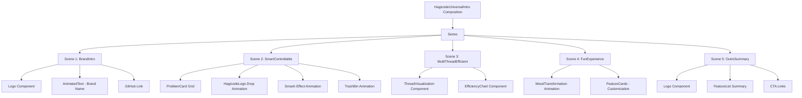

# Change: 创建 Hagicode 通用片头视频

## Why

当前项目缺少独立的通用片头组件，无法作为 Hagicode 产品视频的标准化开场。需要一个展示 Hagicode 核心价值（解决 AI 开发常见问题）的片头，适用于作为视频的标准化开场片段。

## What Changes

- 新增 `HagicodeUniversalIntro` Composition（总时长 420 帧 / 7 秒 @ 60fps）
- 新增 3 个场景组件（Scene Components）对应 3 幕结构
- 新增可复用的可视化组件（问题卡片、砸碎动画、垃圾桶动画）
- 在 `Root.tsx` 中 注册新的 Composition
- 复用现有组件库（FeatureCard、GlassCard、AnimatedText 等）

### 幕次结构

1. **第一幕：品牌展示**（60 帧 / 1 秒）- 软件名称 + GitHub 地址，可作为静态封面
2. **第二幕：智能可控**（180 帧 / 3 秒）- Hagicode 砸碎 AI 开发常见问题（全部丢入垃圾桶）
3. **第三幕：高效多线程**（90 帧 / 1.5 秒）- 1→5 线程对比，20%→100% 效能提升，效能提升 5 倍
4. **第四幕：有趣体验**（60 帧 / 1 秒）- 枯燥开发 → 快乐转变，展示主题/音效/样式定制和成就系统
5. **第五幕：收尾总结**（30 帧 / 0.5 秒）- 品牌名 + 三大核心特点罗列

## UI Design Changes

### 第一幕：品牌展示（静态封面页）

```
┌─────────────────────────────────────────────────────────────────────┐
│                                                                     │
│                      ┌──────────────────────┐                       │
│                      │                      │                       │
│                      │     HAGICODE         │                       │
│                      │                      │                       │
│                      │   AI 开发助手         │                       │
│                      │                      │                       │
│                      │  github.com/...      │                       │
│                      │                      │                       │
│                      └──────────────────────┘                       │
│                                                                     │
│                                                                     │
└─────────────────────────────────────────────────────────────────────┘
```

### 第二幕：智能可控 - Hagicode 砸碎 AI 问题

```
┌─────────────────────────────────────────────────────────────────────┐
│                                                                     │
│   ┌──────────────────────────────────────────────────────────┐    │
│   │                                                           │    │
│   │              AI 开发常见问题                                │    │
│   │                                                           │    │
│   │    ┌──────────┐ ┌──────────┐ ┌──────────┐ ┌──────────┐   │    │
│   │    │ AI 经常  │ │ AI 意外  │ │ AI 无法  │ │ AI 产生  │   │    │
│   │    │   返工   │ │修改范围外 │ │理解项目  │ │  幻觉   │   │    │
│   │    │          │ │   文件   │ │   结构   │ │         │   │    │
│   │    └──────────┘ └──────────┘ └──────────┘ └──────────┘   │    │
│   │                                                           │    │
│   │         ┌──────────┐ ┌──────────┐ ┌──────────┐           │    │
│   │         │ AI 没有  │ │ AI 总是  │ │           │           │    │
│   │         │正确验收  │ │听不懂人话│ │  ...     │           │    │
│   │         │  结果   │ │         │ │           │           │    │
│   │         └──────────┘ └──────────┘ └──────────┘           │    │
│   │                                                           │    │
│   │                    ↓ ↓ ↓                                  │    │
│   │                                                           │    │
│   │              [HAGICODE LOGO 从天而降]                       │    │
│   │                                                           │    │
│   │                    💥 💥 💥                                │    │
│   │                                                           │    │
│   │              [问题卡片被砸碎飞散]                           │    │
│   │                                                           │    │
│   │              ↓ ↓ ↓ ↓ ↓ ↓                                  │    │
│   │                                                           │    │
│   │            🗑️ [全部丢入垃圾桶]                              │    │
│   │                                                           │    │
│   └──────────────────────────────────────────────────────────┘    │
│                                                                     │
└─────────────────────────────────────────────────────────────────────┘
```

**AI 常见问题列表**：
- AI 经常返工
- AI 意外修改了不在范围内的文件
- AI 无法理解项目结构
- AI 产生了幻觉
- AI 没有正确的验收结果
- AI 总是听不懂人话

### 第三幕：高效多线程（对比动画）

```
┌─────────────────────────────────────────────────────────────────────┐
│                                                                     │
│  ┌──────────────────┐  ┌────────────────────────────────────────┐  │
│  │   线程可视化       │  │           效能图表                      │  │
│  │                  │  │                                        │  │
│  │  [●] 单线程       │  │   ██ 20%                               │  │
│  │                  │  │                                        │  │
│  │  ─── 切换 ────→   │  │   ─── 切换 ────→                       │  │
│  │                  │  │                                        │  │
│  │  [●●●●●] 5线程   │  │  ████████████ 100%                     │  │
│  │                  │  │                                        │  │
│  └──────────────────┘  └────────────────────────────────────────┘  │
│                                                                     │
│              效能提升 100%  |  效能提升 5 倍                         │
└─────────────────────────────────────────────────────────────────────┘
```

### 第四幕：有趣体验

```
┌─────────────────────────────────────────────────────────────────────┐
│                                                                     │
│   ┌─────────────┐         ┌─────────────┐                         │
│   │ 😴 枯燥开发  │   →     │ 😊 快乐编码  │                         │
│   └─────────────┘         └─────────────┘                         │
│                                                                     │
│   ┌───────────────────────────────────────────────────────────┐    │
│   │  丰富的主题定制  |  丰富的音效定制  |  丰富的样式定制          │    │
│   │  有趣的成就系统  |  明确的历史简报  |  历史详细情况记录          │    │
│   └───────────────────────────────────────────────────────────┘    │
│                                                                     │
└─────────────────────────────────────────────────────────────────────┘
```

### 第五幕：收尾总结

```
┌─────────────────────────────────────────────────────────────────────┐
│                                                                     │
│                        HAGICODE                                     │
│                                                                     │
│   ✓ 智能可控（消除 AI 开发常见问题）                                   │
│   ✓ 高效多线程（效能提升 5 倍）                                      │
│   ✓ 有趣体验（定制化与成就系统）                                     │
│                                                                     │
│                     github.com/hagicode                             │
│                                                                     │
└─────────────────────────────────────────────────────────────────────┘
```

## Code Flow Changes



## Impact

- Affected specs: N/A（新增功能，不涉及现有规范修改）
- Affected code:
  - 新增 `src/compositions/HagicodeUniversalIntro.tsx`
  - 新增 `src/scenes/intro/BrandIntroScene.tsx`
  - 新增 `src/scenes/intro/SmartControllableScene.tsx`
  - 新增 `src/scenes/intro/MultiThreadEfficientScene.tsx`
  - 新增 `src/scenes/intro/FunExperienceScene.tsx`
  - 新增 `src/scenes/intro/OutroSummaryScene.tsx`
  - 新增 `src/components/intro/ProblemCard.tsx`
  - 新增 `src/components/intro/SmashEffect.tsx`
  - 新增 `src/components/intro/TrashBin.tsx`
  - 新增 `src/components/intro/ThreadVisualization.tsx`
  - 新增 `src/components/intro/EfficiencyChart.tsx`
  - 修改 `src/Root.tsx`（注册新 Composition）
