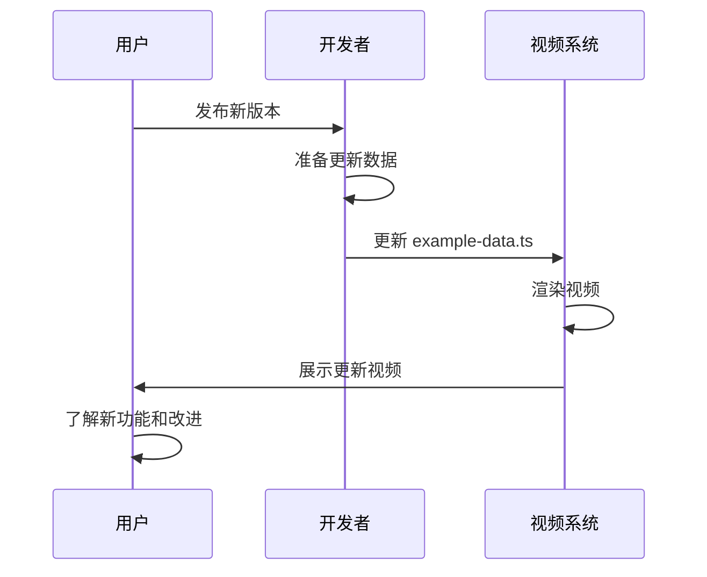
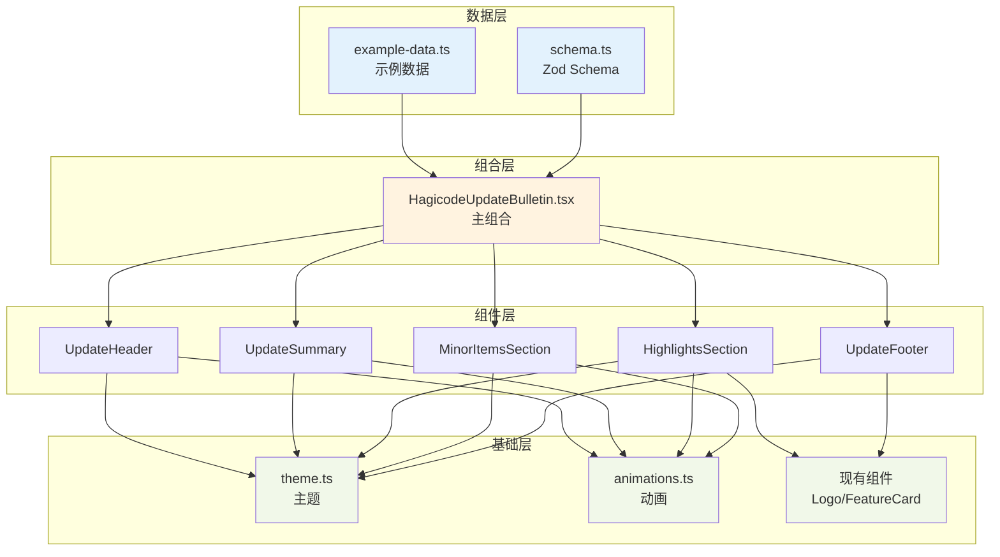
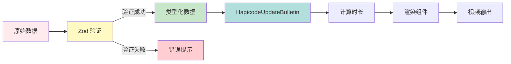
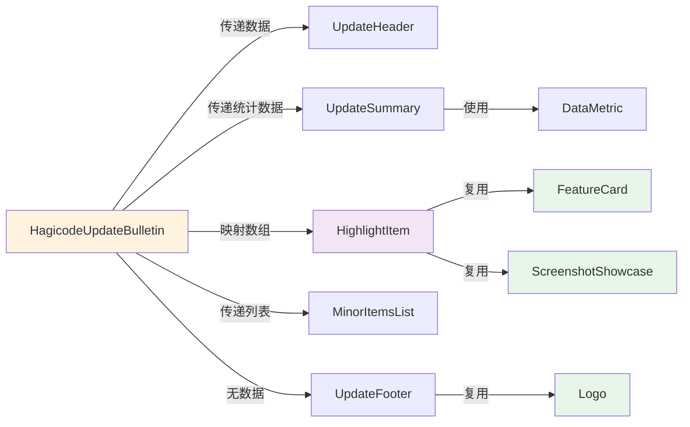

# Design: Hagicode 更新简报视频模板

**Change ID**: `hagicode-update-bulletin-template`
**Related Proposal**: [proposal.md](./proposal.md)

---

## Overview

本文档详细说明 Hagicode 更新简报视频模板的技术设计、架构决策和实现细节。

## Context

### 约束条件

1. **技术栈**: Remotion 4.0 + React 19 + TypeScript
2. **设计系统**: 必须使用现有的 `src/utils/theme.ts` 主题
3. **组件复用**: 优先使用现有组件库
4. **视频规格**: 1920x1080, 30fps, 约 60 秒

### 利益相关者

- 产品团队：需要快速生成更新视频
- 开发团队：维护和扩展模板
- 最终用户：观看更新视频了解新功能

## Goals / Non-Goals

### Goals

- 创建数据驱动的可复用视频模板
- 支持灵活的内容数量（可变数量的更新项）
- 保持与现有视频风格一致
- 提供类型安全的数据接口（Zod）

### Non-Goals

- 实时编辑功能（通过代码修改数据）
- 多语言支持（仅中文）
- 复杂的 3D 效果
- 音频同步处理

## Decisions

### Decision 1: 使用 Zod Schema 定义数据结构

**选择理由**:
- 类型安全：TypeScript 完整支持
- 运行时验证：确保数据正确性
- IDE 支持：自动补全和类型提示
- 文档即代码：Schema 即数据文档

**替代方案**:
- 纯 TypeScript 接口：无运行时验证
- JSON Schema：不够类型友好

### Decision 2: 组件化架构

**选择理由**:
- 可复用：各段落组件可独立使用
- 可测试：组件级别测试更容易
- 可维护：清晰的职责分离

**架构设计**:
```
HagicodeUpdateBulletin (容器)
├── UpdateHeader (头部)
├── UpdateSummary (摘要)
├── HighlightsSection (重点区)
│   └── HighlightItem[] (重点项)
├── MinorItemsSection (次要点区)
│   └── MinorItemsList (列表)
└── UpdateFooter (结尾)
```

### Decision 3: 动态时长计算

**选择理由**:
- 内容可变：不同版本更新数量不同
- 用户体验：避免内容过多导致匆忙
- 技术实现：Remotion 支持基于内容的时长

**计算公式**:
```
总时长 = 头部(5s) + 摘要(10s) + 重点项(N×15s) + 次要点(10s) + 结尾(5s)
```

### Decision 4: 资源处理策略

**选择理由**:
- 灵活性：支持本地和远程资源
- 开发便利：public 目录用于开发测试
- 生产就绪：远程 URL 用于 CI/CD

**实现**:
- 优先使用 `staticFile()` 加载本地资源
- 回退到远程 URL
- 截图为可选字段

## UI/UX Design

### 视频界面分段设计

#### 1. 头部 (Header) - 0-5秒

```
┌──────────────────────────────────────────────────────────────┐
│                                                              │
│                   ┌─────────────────────┐                    │
│                   │    Hagicode         │                    │
│                   │    更新简报         │                    │
│                   └─────────────────────┘                    │
│                                                              │
│                   v1.2.0        2026-01-17                   │
│                                                              │
└──────────────────────────────────────────────────────────────┘

动画:
- Logo 从上方淡入 + 缩放 (spring 动画)
- 版本号和日期从下方滑入 (interpolate 动画)
- 背景使用渐变色过渡
```

#### 2. 摘要 (Summary) - 5-15秒

```
┌──────────────────────────────────────────────────────────────┐
│                                                              │
│                        本版本更新                             │
│                                                              │
│    ┌──────────┐    ┌──────────┐    ┌──────────┐             │
│    │   📊     │    │   🐛     │    │   ✨     │             │
│    │          │    │          │    │          │             │
│    │   3      │    │   5      │    │   8      │             │
│    │ 新功能   │    │ Bug修复  │    │  改进    │             │
│    └──────────┘    └──────────┘    └──────────┘             │
│                                                              │
└──────────────────────────────────────────────────────────────┘

动画:
- 标题从左侧滑入
- 统计卡片依次出现 (使用 Sequence delay)
- 数字从 0 开始计数 (interpolate 动画)
- 图标轻微脉冲效果
```

#### 3. 重点修改 (Highlights) - 15-45秒

```
┌──────────────────────────────────────────────────────────────┐
│                                                              │
│                        🔥 重点更新                            │
│                                                              │
│  ┌──────────────────────────────────────────────────────┐   │
│  │                                                        │   │
│  │  AI 代码生成增强                    [功能] [AI]        │   │
│  │                                                        │   │
│  │  支持多文件同时生成，大幅提升开发效率。新增智能补全     │   │
│  │  功能，理解项目上下文，提供更精准的代码建议。           │   │
│  │                                                        │   │
│  │  ┌────────────────────────────────────────────────┐   │   │
│  │  │                                                │   │   │
│  │  │           [功能截图或演示画面]                  │   │   │
│  │  │                                                │   │   │
│  │  └────────────────────────────────────────────────┘   │   │
│  │                                                        │   │
│  └──────────────────────────────────────────────────────┘   │
│                                                              │
└──────────────────────────────────────────────────────────────┘

动画:
- 卡片从右侧滑入 (scale + fade)
- 标签逐个出现
- 截图延迟淡入，带边框发光效果
- 每个重点项停留 10-15 秒
- 多个重点项使用 <Series> 依次展示
```

#### 4. 次要修改列表 (Minor Items) - 45-55秒

```
┌──────────────────────────────────────────────────────────────┐
│                                                              │
│                        📝 详细变更                            │
│                                                              │
│  ┌──────────────────────────────────────────────────────┐   │
│  │  • 修复了会话创建时的权限问题                         │   │
│  │    [bugfix] 权限                                      │   │
│  │                                                        │   │
│  │  • 优化了 OpenSpec 提案的加载速度                     │   │
│  │    [improvement] 性能                                 │   │
│  │                                                        │   │
│  │  • 新增了暗色模式切换功能                             │   │
│  │    [feature] UI                                       │   │
│  │                                                        │   │
│  │  • 更新了依赖包到最新版本                             │   │
│  │    [improvement] 依赖                                 │   │
│  │                                                        │   │
│  └──────────────────────────────────────────────────────┘   │
│                                                              │
└──────────────────────────────────────────────────────────────┘

动画:
- 列表容器从下方淡入
- 列表项依次出现 (使用 Sequence)
- 如果项目过多，使用滚动或分页
- 标签使用不同颜色区分类型
```

#### 5. 结尾 (Footer) - 55-60秒

```
┌──────────────────────────────────────────────────────────────┐
│                                                              │
│                                                              │
│                   ┌─────────────────────┐                    │
│                   │                     │                    │
│                   │     Hagicode        │                    │
│                   │                     │                    │
│                   └─────────────────────┘                    │
│                                                              │
│                    感谢使用，持续更新中...                    │
│                                                              │
│                                                              │
└──────────────────────────────────────────────────────────────┘

动画:
- Logo 从中心放大淡入
- 副标题延迟出现
- 背景渐变到品牌色
```

### 交互流程



### 响应式设计

虽然视频输出固定为 1920x1080，但设计时考虑：

- **安全区域**: 内容距离边缘至少 100px
- **文字大小**: 确保在移动设备上可读
- **对比度**: 符合 WCAG AA 标准

## Technical Design

### 架构图



### 数据流



### 组件交互图



### 详细代码变更

#### 新增文件清单

| 文件路径 | 说明 | 依赖 |
|---------|------|------|
| `src/compositions/HagicodeUpdateBulletin.tsx` | 主组合组件 | schema.ts, 组件 |
| `src/compositions/schema.ts` | Zod schema 定义 | zod |
| `src/compositions/example-data.ts` | 示例数据 | schema.ts |
| `src/components/update-bulletin/UpdateHeader.tsx` | 头部组件 | theme.ts |
| `src/components/update-bulletin/UpdateSummary.tsx` | 摘要组件 | theme.ts, DataMetric |
| `src/components/update-bulletin/HighlightItem.tsx` | 重点项组件 | theme.ts, FeatureCard, ScreenshotShowcase |
| `src/components/update-bulletin/MinorItemsList.tsx` | 次要点列表组件 | theme.ts |
| `src/components/update-bulletin/UpdateFooter.tsx` | 结尾组件 | Logo |

#### 修改文件清单

| 文件路径 | 变更类型 | 具体变更 | 变更原因 |
|---------|---------|---------|---------|
| `src/Root.tsx` | 新增 | 添加 HagicodeUpdateBulletin 组合注册 | 注册新视频入口 |

### Schema 设计

```typescript
// src/compositions/schema.ts

import { z } from 'zod';

// 标签类型
export const TagSchema = z.enum([
  'feature', 'bugfix', 'improvement', 'ai', 'ui', 'performance', 'other'
]);

// 重点修改项
export const HighlightItemSchema = z.object({
  id: z.string().optional(),
  title: z.string().min(1, '标题不能为空'),
  description: z.string().min(1, '描述不能为空'),
  screenshot: z.string().optional(),
  tags: z.array(TagSchema).optional().default([]),
});

// 次要修改项
export const MinorItemSchema = z.object({
  category: TagSchema,
  title: z.string().min(1, '标题不能为空'),
  description: z.string().optional(),
});

// 完整更新数据
export const UpdateBulletinDataSchema = z.object({
  version: z.string().regex(/^v?\d+\.\d+\.\d+(-.*)?$/, '版本号格式不正确'),
  releaseDate: z.string().regex(/^\d{4}-\d{2}-\d{2}$/, '日期格式不正确'),
  summary: z.string().optional(),
  highlights: z.array(HighlightItemSchema).min(0).max(5),
  minorItems: z.array(MinorItemSchema).min(0).max(20),
});

// 类型导出
export type UpdateBulletinData = z.infer<typeof UpdateBulletinDataSchema>;
export type HighlightItem = z.infer<typeof HighlightItemSchema>;
export type MinorItem = z.infer<typeof MinorItemSchema>;
```

### 组件接口设计

```typescript
// UpdateHeader.tsx
export interface UpdateHeaderProps {
  version: string;
  releaseDate: string;
}

// UpdateSummary.tsx
export interface UpdateSummaryProps {
  featuresCount: number;
  bugfixesCount: number;
  improvementsCount: number;
  summary?: string;
}

// HighlightItem.tsx
export interface HighlightItemProps {
  item: HighlightItem;
  index: number;
  total: number;
}

// MinorItemsList.tsx
export interface MinorItemsListProps {
  items: MinorItem[];
  maxDisplay?: number;
}

// UpdateFooter.tsx
export interface UpdateFooterProps {
  tagline?: string;
}
```

## 实现细节

### 时长计算

```typescript
// 计算视频总时长
const calculateDuration = (data: UpdateBulletinData): number => {
  const HEADER_DURATION = 150; // 5秒 @ 30fps
  const SUMMARY_DURATION = 300; // 10秒
  const HIGHLIGHT_PER_ITEM = 450; // 15秒/项
  const MINOR_ITEMS_DURATION = 300; // 10秒
  const FOOTER_DURATION = 150; // 5秒

  return (
    HEADER_DURATION +
    SUMMARY_DURATION +
    data.highlights.length * HIGHLIGHT_PER_ITEM +
    MINOR_ITEMS_DURATION +
    FOOTER_DURATION
  );
};
```

### Sequence 时序设计

```typescript
// 主组件中的 Sequence 布局
<>
  {/* 头部 */}
  <Sequence from={0} durationInFrames={150}>
    <UpdateHeader {...headerProps} />
  </Sequence>

  {/* 摘要 */}
  <Sequence from={150} durationInFrames={300}>
    <UpdateSummary {...summaryProps} />
  </Sequence>

  {/* 重点修改 - 使用 Series */}
  <Series>
    {data.highlights.map((item, index) => (
      <Series.Sequence
        key={item.id || index}
        durationInFrames={450}
      >
        <HighlightItem item={item} index={index} total={data.highlights.length} />
      </Series.Sequence>
    ))}
  </Series>

  {/* 次要修改 */}
  <Sequence from={450 + highlightsLength * 450} durationInFrames={300}>
    <MinorItemsList items={data.minorItems} />
  </Sequence>

  {/* 结尾 */}
  <Sequence from={totalDuration - 150} durationInFrames={150}>
    <UpdateFooter />
  </Sequence>
</>
```

### 动画效果

```typescript
// 使用现有动画工具
import { fadeIn, slideUp, useFadeIn, useSlideUp } from '../../utils/animations';

// 数字计数动画
const countUp = (frame: number, delay: number, endValue: number): number => {
  return Math.floor(interpolate(
    frame,
    [delay, delay + 60], // 2秒动画
    [0, endValue],
    { extrapolateRight: 'clamp' }
  ));
};

// 卡片入场动画
const cardEntrance = (frame: number, delay: number) => {
  const progress = spring({
    frame: frame - delay,
    fps: 30,
    config: { damping: 15, stiffness: 100 },
  });
  return progress;
};
```

## Risks / Trade-offs

### 风险

| 风险 | 影响 | 缓解措施 |
|------|------|----------|
| 内容过多导致视频过长 | 用户体验下降 | 限制最大数量，截断显示 |
| 截图尺寸不一致 | 视觉不统一 | 统一容器尺寸，object-fit |
| 数据验证失败 | 渲染失败 | 提供默认示例数据 |
| 动画性能问题 | 渲染卡顿 | 简化动画，减少过渡 |

### 权衡

1. **灵活性与简单性**:
   - 选择: 支持可变数量的内容项
   - 代价: 时长计算复杂度增加
   - 收益: 一个模板适用所有版本

2. **视觉效果与性能**:
   - 选择: 使用现有动画函数
   - 代价: 视觉效果相对简单
   - 收益: 开发效率高，渲染稳定

3. **类型安全与易用性**:
   - 选择: Zod schema 严格验证
   - 代价: 数据准备需要遵循格式
   - 收益: 运行时安全，IDE 支持

## Migration Plan

不涉及迁移，这是新增功能。

## Open Questions

1. **版本号格式**: 是否支持语义化版本之外的其他格式？
2. **日期格式**: 是否需要支持不同的日期显示格式？
3. **标签颜色**: 是否为每个标签类型定义特定颜色？
4. **导出配置**: 是否需要预定义的导出配置？

## 附录

### 颜色规范

使用现有 `theme.ts` 中的颜色：

- 主色: `colors.primary` (紫罗兰渐变)
- 辅色: `colors.secondary` (青蓝渐变)
- 成功: `colors.success` (绿色)
- 背景: `colors.background` (深色系)

### 字体规范

- 标题: `typography.fontFamily.heading`
- 正文: `typography.fontFamily.body`
- 代码: `typography.fontFamily.mono`

### 动画时长规范

- 快速: `duration.fast` (6帧)
- 正常: `duration.normal` (9帧)
- 慢速: `duration.slow` (15帧)
