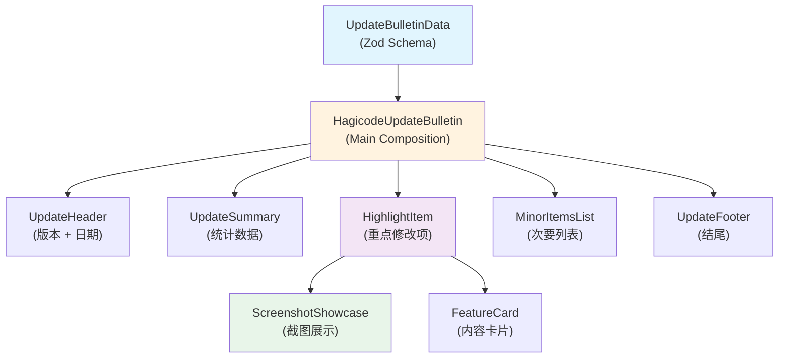

# Proposal: 创建 Hagicode 更新简报视频模板

**Change ID**: `hagicode-update-bulletin-template`
**Status**: ExecutionCompleted
**Created**: 2026-01-17
**Author**: OpenSpec Proposal

---

## Overview

为 Hagicode 项目创建一个新的 Remotion 视频模板，用于程序化生成产品更新简报视频。该模板将支持通过结构化数据驱动的方式，自动生成展示版本更新信息、功能特性、Bug 修复等内容的专业视频。

## Background

### 问题陈述

当前 Hagicode 视频项目已具备产品介绍视频的能力，但缺少一种标准化的方式来展示产品版本的更新情况。产品团队需要一个能够快速生成更新简报视频的模板，用于：

1. **版本发布沟通**: 向用户传达新版本的更新内容
2. **开发进度汇报**: 向利益相关者展示开发进展
3. **功能特性宣传**: 突出展示新功能和改进点
4. **变更历史记录**: 以视频形式保存版本迭代历史

### 现有资源

- **Remotion 视频项目**: 已建立的基础架构和组件库
- **主题系统**: `src/utils/theme.ts` 定义的颜色和样式规范
- **动画工具**: `src/utils/animations.ts` 提供的动画函数
- **可复用组件**: Logo, FeatureCard, ScreenshotShowcase 等组件

## Proposal

### 目标

创建一个名为 "Hagicode 更新简报" 的 Remotion Composition，实现：

1. **数据驱动**: 通过 Zod schema 定义结构化的更新数据格式
2. **模块化设计**: 可复用的视频段落组件
3. **灵活配置**: 支持不同数量和类型的内容展示
4. **美观呈现**: 与现有视频风格一致的视觉效果

### 视频内容结构

```
┌─────────────────────────────────────────────────────────────┐
│  Hagicode 更新简报视频结构                                    │
├─────────────────────────────────────────────────────────────┤
│  0-5s    │ 头部信息: 版本号 + 发布日期                        │
│  5-15s   │ 更新摘要: 主要特征 + 次要修改统计                   │
│  15-45s  │ 重点修改: 逐个展示重点功能（每个 10-15s）           │
│  45-55s  │ 次要列表: Bug 修复、小改进的详细列表                │
│  55-60s  │ 结尾: Logo + 感谢观看                              │
└─────────────────────────────────────────────────────────────┘
```

### 技术方案

#### 1. 数据 Schema 设计

使用 Zod 定义更新数据结构：

```typescript
// 重点修改项
const HighlightItemSchema = z.object({
  title: z.string(),
  description: z.string(),
  screenshot: z.string().optional(), // URL 或 staticFile 路径
  tags: z.array(z.string()).optional(),
});

// 次要修改项
const MinorItemSchema = z.object({
  category: z.enum(['feature', 'bugfix', 'improvement', 'other']),
  title: z.string(),
  description: z.string().optional(),
});

// 完整更新数据
const UpdateBulletinSchema = z.object({
  version: z.string(),           // 如 "v1.2.0"
  releaseDate: z.string(),       // 如 "2026-01-17"
  highlights: z.array(HighlightItemSchema),
  minorItems: z.array(MinorItemSchema),
  summary: z.string().optional(), // 版本总结
});
```

#### 2. 组件架构

```
src/compositions/
├── HagicodeUpdateBulletin.tsx    # 主组合组件
├── schema.ts                      # Zod schema 定义
└── example-data.ts                # 示例数据

src/components/update-bulletin/
├── UpdateHeader.tsx               # 头部: 版本号 + 日期
├── UpdateSummary.tsx              # 摘要: 统计数据展示
├── HighlightItem.tsx              # 重点修改项展示
├── MinorItemsList.tsx             # 次要修改列表
└── UpdateFooter.tsx               # 结尾 Logo
```

#### 3. 动画与时序

使用 Remotion 的 `<Sequence>` 和 `<Series>` 组件控制时序：

- **头部**: 使用 `spring()` 实现弹性入场
- **摘要**: 使用 `interpolate()` 实现数字计数动画
- **重点项**: 使用 `<Series>` 依次展示，每个项独立入场
- **次要点**: 使用列表滚动或逐项淡入效果
- **转场**: 场景间使用淡入淡出过渡

#### 4. 资源处理

- **截图**: 支持 `staticFile()` 引用 public 目录或远程 URL
- **图标**: 复用现有组件库或使用 lucide-react
- **配色**: 使用 `src/utils/theme.ts` 中的定义

### Implementation Scope

#### 包含内容

- [x] 项目结构分析
- [ ] Zod schema 定义
- [ ] 主 Composition 创建
- [ ] 各段落组件开发
- [ ] 示例数据准备
- [ ] 动画效果实现
- [ ] 在 Root.tsx 中注册
- [ ] 预览和测试

#### 不包含内容

- 音频/配音（可后续添加）
- 多语言支持（仅中文）
- 复杂 3D 效果

## Impact Assessment

### 用户体验影响

- **正面**: 产品更新信息以更直观的方式呈现
- **中性**: 无现有用户体验改变
- **负面**: 无

### 技术影响

- **新增**: 新的 Composition 和相关组件
- **修改**: `src/Root.tsx` 添加新入口
- **依赖**: 复用现有主题和工具函数

### 性能影响

- 无运行时性能影响（视频为独立输出产物）

## UI 设计变更

### 视频界面结构

```
┌──────────────────────────────────────────────────────────┐
│  ┌────────────────────────────────────────────────────┐  │
│  │              Hagicode 更新简报                      │  │
│  │              v1.2.0 │ 2026-01-17                   │  │
│  └────────────────────────────────────────────────────┘  │
│                                                           │
│  ┌────────────────────────────────────────────────────┐  │
│  │  本版本更新                                          │  │
│  │  📊 3 个新功能   🐛 5 个修复   ✨ 8 个改进          │  │
│  └────────────────────────────────────────────────────┘  │
│                                                           │
│  ┌────────────────────────────────────────────────────┐  │
│  │  🔥 重点更新                                         │  │
│  │                                                      │  │
│  │  ┌──────────────────────────────────────────────┐  │  │
│  │  │ AI 代码生成增强                                 │  │  │
│  │  │ 支持多文件同时生成，提升开发效率                │  │  │
│  │  │ [截图展示]                                     │  │  │
│  │  └──────────────────────────────────────────────┘  │  │
│  └────────────────────────────────────────────────────┘  │
│                                                           │
│  ┌────────────────────────────────────────────────────┐  │
│  │  📝 详细变更                                         │  │
│  │  • 修复了会话创建时的权限问题                       │  │
│  │  • 优化了 OpenSpec 提案的加载速度                   │  │
│  │  • 新增了暗色模式切换功能                           │  │
│  └────────────────────────────────────────────────────┘  │
│                                                           │
│  ┌────────────────────────────────────────────────────┐  │
│  │              Hagicode                               │  │
│  │         感谢使用，持续更新中...                     │  │
│  └────────────────────────────────────────────────────┘  │
└──────────────────────────────────────────────────────────┘
```

## 代码流程变更

### 组件数据流



### 文件变更清单

| 文件路径 | 变更类型 | 变更原因 | 影响范围 |
|---------|---------|---------|---------|
| `src/compositions/HagicodeUpdateBulletin.tsx` | 新增 | 主视频组合组件 | 视频组合 |
| `src/compositions/schema.ts` | 新增 | Zod schema 定义 | 数据验证 |
| `src/compositions/example-data.ts` | 新增 | 示例演示数据 | 开发测试 |
| `src/components/update-bulletin/UpdateHeader.tsx` | 新增 | 头部信息组件 | UI 组件 |
| `src/components/update-bulletin/UpdateSummary.tsx` | 新增 | 摘要统计组件 | UI 组件 |
| `src/components/update-bulletin/HighlightItem.tsx` | 新增 | 重点修改项组件 | UI 组件 |
| `src/components/update-bulletin/MinorItemsList.tsx` | 新增 | 次要列表组件 | UI 组件 |
| `src/components/update-bulletin/UpdateFooter.tsx` | 新增 | 结尾组件 | UI 组件 |
| `src/Root.tsx` | 修改 | 注册新组合 | 视频入口 |

## Alternatives Considered

### 1. 手动制作更新视频

**方案**: 使用传统视频编辑软件手动制作每次更新

**优点**:
- 完全自由的控制
- 无需开发成本

**缺点**:
- 每次更新都需要重新制作
- 无法批量生成
- 版本控制困难

**结论**: 不采用 - 缺乏可扩展性

### 2. 纯文字模板

**方案**: 仅使用文字动画，不包含截图和复杂视觉效果

**优点**:
- 实现简单
- 快速开发

**缺点**:
- 视觉效果单调
- 无法直观展示功能变化

**结论**: 不采用 - 用户体验不佳

### 3. 复用现有产品介绍视频模板

**方案**: 修改现有 HagicodeIntro 视频模板

**优点**:
- 复用现有代码

**缺点**:
- 结构差异大，难以适配
- 可能影响现有视频

**结论**: 不采用 - 独立创建更清晰

## Risks and Mitigations

| 风险 | 影响 | 概率 | 缓解措施 |
|------|------|------|----------|
| 数据格式设计不合理 | 中 | 低 | 先定义 schema，预留扩展字段 |
| 动画效果不够流畅 | 低 | 中 | 使用现有动画工具函数 |
| 截图素材不足 | 中 | 中 | 截图为可选项，支持纯文字展示 |
| 视频时长控制 | 低 | 低 | 使用动态计算，根据内容量调整 |

## Success Criteria

### 完成标准

- [ ] 新 Composition 在 Remotion Studio 中可预览
- [ ] Zod schema 验证正常工作
- [ ] 示例数据可渲染完整视频
- [ ] 至少包含 2 个重点修改项和 3 个次要点
- [ ] 动画流畅，视觉风格统一

### 质量标准

- [ ] 代码通过 TypeScript 类型检查
- [ ] 代码通过 ESLint 检查
- [ ] 组件可复用性良好
- [ ] 文档完整（使用说明）

## Open Questions

1. **默认时长**: 建议的默认视频时长是多少？（建议 60 秒）
2. **截图存储**: 截图文件放在 public 目录还是支持远程 URL？
3. **标签系统**: 是否需要为修改项添加标签分类？
4. **多版本支持**: 是否需要支持多个版本的更新视频同时存在？

## References

- 现有 Remotion 项目结构
- `src/utils/theme.ts` - 主题定义
- `src/utils/animations.ts` - 动画工具
- `src/components/` - 可复用组件
- OpenSpec 变更: `hagicode-product-intro-video-with-remotion`

---

**下一步**: 本提案获得批准后，将进入 `tasks.md` 中定义的实施阶段。
