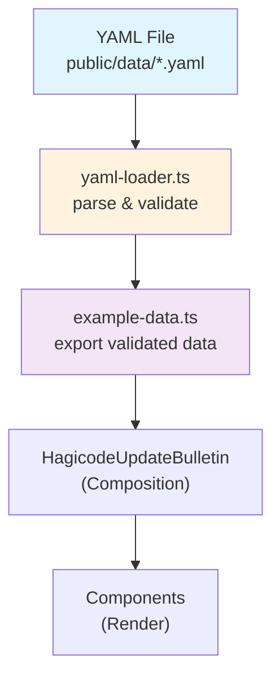

# Proposal: 数据迁移至YAML格式

**Change ID**: `yaml-data-migration`
**Status**: ExecutionCompleted
**Created**: 2026-01-17
**Author**: OpenSpec Proposal

---

## Overview

将 Hagicode 更新简报视频模板中的硬编码数据迁移到 YAML 格式文件，实现数据与代码的分离。通过创建 `public/data/` 目录存放 YAML 数据文件，并实现运行时加载机制，提升数据的可维护性、可读性和可扩展性。

## Background

### 问题陈述

当前项目在 `src/compositions/example-data.ts` 中硬编码了视频内容数据，包括 `exampleData`、`minimalData` 和 `maximumData` 三个数据对象。这种做法存在以下问题：

1. **可维护性差**：修改视频内容需要直接编辑 TypeScript 代码，容易引入语法错误
2. **可读性低**：YAML 格式对结构化数据的展示比代码更直观
3. **可扩展性弱**：非技术人员难以修改视频内容
4. **版本控制不便**：代码变更和数据变更混在一起，难以区分

### 现有资源

- **Zod Schema**: `src/compositions/schema.ts` 定义的数据验证结构
- **硬编码数据**: `src/compositions/example-data.ts` 中的三个数据集
- **验证机制**: `validateUpdateData()` 函数确保类型安全

## Proposal

### 目标

实现数据到 YAML 格式的迁移，同时保持：

1. **类型安全**：加载的数据需通过 Zod schema 验证
2. **向后兼容**：保持现有的 API 导出不变
3. **运行时支持**：支持 Remotion 开发服务器和构建渲染
4. **可扩展性**：为未来支持多语言、多版本数据奠定基础

### 技术方案

#### 1. 数据文件结构

```
public/data/
├── update-bulletin/
│   ├── example-data.yaml       # 完整示例数据
│   ├── minimal-data.yaml       # 最小测试数据
│   └── maximum-data.yaml       # 最大边界测试数据
```

#### 2. YAML 加载机制

创建 `src/utils/yaml-loader.ts` 工具模块：

```typescript
import { staticFile } from 'remotion';
import { validateUpdateData, type UpdateBulletinData } from '../compositions/schema';

// 构建时数据加载（使用 import）
async function loadYamlBuildTime(path: string): Promise<UpdateBulletinData>

// 运行时数据加载（使用 fetch + staticFile）
async function loadYamlRuntime(path: string): Promise<UpdateBulletinData>
```

#### 3. 导出方式更新

更新 `src/compositions/example-data.ts`：

```typescript
// 保持相同的导出接口
export const exampleData: UpdateBulletinData = loadYaml('update-bulletin/example-data.yaml');
export const minimalData: UpdateBulletinData = loadYaml('update-bulletin/minimal-data.yaml');
export const maximumData: UpdateBulletinData = loadYaml('update-bulletin/maximum-data.yaml');
```

#### 4. 依赖库选择

使用 `js-yaml` 库进行 YAML 解析：

```bash
npm install js-yaml
npm install --save-dev @types/js-yaml
```

### Implementation Scope

#### 包含内容

- [ ] 安装 YAML 解析依赖
- [ ] 创建 `public/data/update-bulletin/` 目录
- [ ] 将三个数据对象导出为 YAML 文件
- [ ] 实现 `src/utils/yaml-loader.ts` 工具模块
- [ ] 更新 `src/compositions/example-data.ts` 使用新的加载机制
- [ ] 更新文档说明新的数据格式

#### 不包含内容

- 数据格式变更（保持与现有 schema 一致）
- 多语言支持（可后续添加）
- 动态数据加载（如从 API 获取）

## Impact Assessment

### 用户体验影响

- **正面**: 无直接影响
- **中性**: 视频输出结果保持不变
- **负面**: 无

### 技术影响

- **新增**: `src/utils/yaml-loader.ts` 工具模块
- **新增**: `public/data/update-bulletin/` YAML 数据文件
- **修改**: `src/compositions/example-data.ts` 使用新的加载方式
- **依赖**: 新增 `js-yaml` 依赖

### 性能影响

- **构建时**: 微小增加（YAML 解析）
- **运行时**: 无影响（数据在模块加载时解析）

## UI 设计变更

无 UI 变更。视频视觉效果保持不变。

## 代码流程变更

### 数据加载流程



### 文件变更清单

| 文件路径 | 变更类型 | 变更原因 | 影响范围 |
|---------|---------|---------|---------|
| `public/data/update-bulletin/example-data.yaml` | 新增 | 存放示例数据 | 数据源 |
| `public/data/update-bulletin/minimal-data.yaml` | 新增 | 存放最小测试数据 | 数据源 |
| `public/data/update-bulletin/maximum-data.yaml` | 新增 | 存放最大测试数据 | 数据源 |
| `src/utils/yaml-loader.ts` | 新增 | YAML 加载工具 | 工具模块 |
| `src/compositions/example-data.ts` | 修改 | 使用 YAML 加载 | 数据导出 |
| `package.json` | 修改 | 添加 js-yaml 依赖 | 项目依赖 |

## Alternatives Considered

### 1. 使用 JSON 格式

**方案**: 将数据迁移到 JSON 文件

**优点**:
- 原生支持，无需额外依赖
- 浏览器可直接解析

**缺点**:
- 不支持注释
- 格式不够直观
- 引号要求严格

**结论**: 不采用 - YAML 可读性更好

### 2. 使用 TOML 格式

**方案**: 将数据迁移到 TOML 文件

**优点**:
- 格式简洁
- 支持注释

**缺点**:
- JavaScript 生态支持较弱
- 需要额外解析库

**结论**: 不采用 - YAML 生态更成熟

### 3. 保持硬编码

**方案**: 不进行迁移，保持现状

**优点**:
- 无需开发成本
- 类型检查最强

**缺点**:
- 可维护性问题持续存在
- 非技术人员无法修改

**结论**: 不采用 - 可维护性问题值得解决

## Risks and Mitigations

| 风险 | 影响 | 概率 | 缓解措施 |
|------|------|------|----------|
| YAML 语法错误导致加载失败 | 高 | 低 | 使用 Zod 验证捕获错误，提供清晰的错误信息 |
| Remotion 静态文件加载限制 | 中 | 中 | 使用 import.meta.url 或 fetch API 兜底 |
| TypeScript 类型不一致 | 中 | 低 | 严格使用 Zod schema 验证，类型从 schema 推断 |
| 构建时路径问题 | 低 | 中 | 测试开发环境和生产构建两种场景 |

## Success Criteria

### 完成标准

- [ ] YAML 文件创建完成，数据与原有数据一致
- [ ] `yaml-loader.ts` 工具模块实现
- [ ] `example-data.ts` 使用新加载方式
- [ ] 在 Remotion Studio 中可正常预览
- [ ] 视频渲染结果与迁移前一致
- [ ] 文档更新，说明新的数据格式

### 质量标准

- [ ] 通过 TypeScript 类型检查
- [ ] 通过 ESLint 检查
- [ ] 所有示例数据正常加载
- [ ] Zod 验证正常工作

## Open Questions

1. **构建方式**: 是否需要在构建时预验证所有 YAML 文件？
2. **错误处理**: YAML 加载失败时是否提供降级方案？
3. **多数据源**: 未来是否需要支持从多个 YAML 文件组合数据？

## References

- 现有 Schema: `src/compositions/schema.ts`
- 现有数据: `src/compositions/example-data.ts`
- js-yaml 文档: https://github.com/nodeca/js-yaml
- Remotion 静态文件: https://www.remotion.dev/docs/webpack/staticfiles

---

**下一步**: 本提案获得批准后，将进入 `tasks.md` 中定义的实施阶段。
