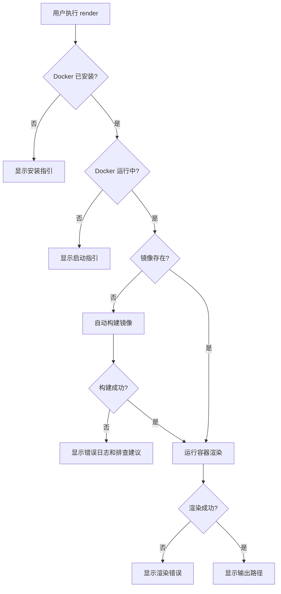
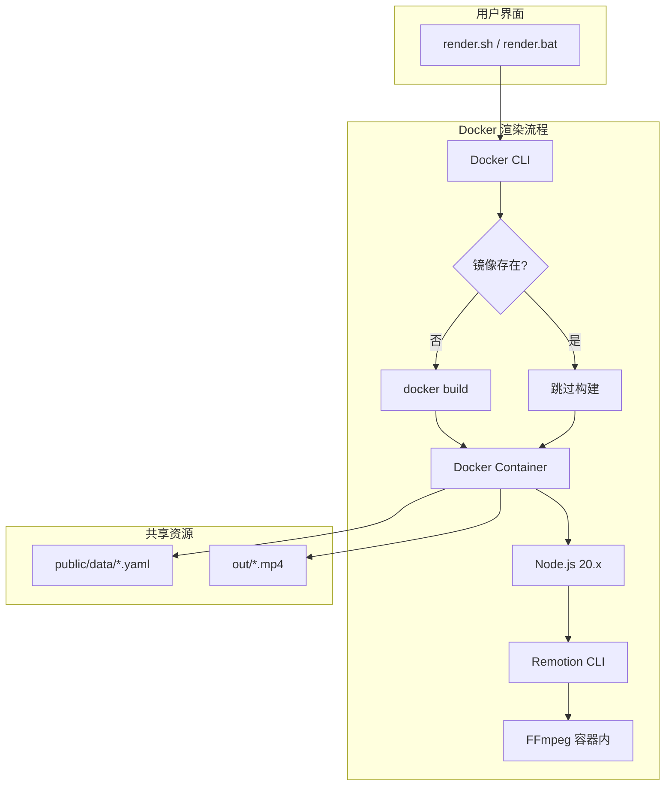
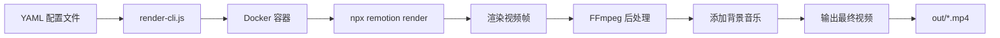

# Design: Docker容器化Remotion渲染环境

## Context

### Background
当前 Hagicode Video 项目使用 Remotion 框架进行视频渲染,依赖本地 Node.js 环境和 FFmpeg。团队协作中发现以下问题:

1. **环境一致性差**:不同操作系统的渲染结果可能存在细微差异(字体、编码器版本等)
2. **配置成本高**:新成员需要安装 Node.js、FFmpeg、配置环境变量等
3. **资源竞争**:渲染任务占用大量 CPU 和内存,影响开发环境性能
4. **CI/CD 困难**:在 GitHub Actions 等环境中需要重复配置依赖

### Constraints
- **容器优先**:所有渲染流程在 Docker 容器内完成,包括 FFmpeg 后处理
- **性能**:容器化渲染的性能开销应控制在可接受范围内(< 10%)
- **镜像大小**:镜像应尽可能小,便于分发和缓存(目标 < 1.5GB)
- **跨平台**:支持 Windows、Linux、macOS 三大主流平台
- **预构建依赖**:node_modules 必须在镜像构建时安装,容器启动即用

### Stakeholders
- **开发团队**:需要简单易用的渲染工具,支持日常开发
- **CI/CD 系统**:需要稳定的、可复现的渲染环境
- **未来分布式渲染**:为 Remotion Lambda 或自建渲染农场预留接口

## Goals / Non-Goals

### Goals
1. **环境一致性**:确保所有平台使用相同的 Node.js、Remotion、FFmpeg 版本
2. **易用性**:提供一键渲染命令,用户无需学习复杂的 Docker 命令
3. **资源隔离**:渲染任务在独立容器中运行,不影响宿主机性能
4. **可扩展性**:支持并行渲染(同时运行多个容器实例)
5. **文档完善**:提供清晰的故障排查指南和最佳实践
6. **启动即用**:镜像包含预构建的 node_modules,容器启动后立即可渲染

### Non-Goals
- **不支持本地渲染**:所有渲染必须在容器内完成
- **不实现分布式调度**:仅实现单容器化,不涉及容器编排(Kubernetes、Swarm)
- **不优化镜像构建时间**:首次构建 3-5 分钟可接受,优先考虑稳定性和兼容性
- **不修改 Remotion 配置**:保持 Remotion composition 和 props 结构不变

## Decisions

### Decision 1: 基础镜像选择

**选择**: `node:20-bullseye`

**理由**:
- Remotion 4.0.405 要求 Node.js 18+,当前项目使用 Node.js 20.x
- `bullseye`(Debian 11)提供稳定且熟悉的 Linux 环境
- 包含 FFmpeg 的官方包(`ffmpeg`),无需手动编译
- 镜像大小适中(约 400MB 基础)

**替代方案**:
- `node:20-alpine`:更小(约 120MB),但 FFmpeg 需要手动配置,字体支持不完善
- `node:20-slim`:介于 bullseye 和 alpine 之间,但缺少某些系统库
- Ubuntu 基础镜像:与 Debian 类似,但略大且无显著优势

**权衡**:
- 牺牲镜像大小换取配置简单性和兼容性
- 选择官方包而非手动编译 FFmpeg,确保稳定性

### Decision 2: 依赖安装策略

**选择**:使用 `npm ci` 而非 `npm install`

**理由**:
- `npm ci` 跳过用户配置,适合 CI/CD 和容器环境
- 更快的安装速度(跳过某些优化步骤)
- 确保 `package-lock.json` 的严格一致性

**Dockerfile 层级优化**:
```dockerfile
COPY package*.json ./
RUN npm ci
COPY . .
```

**理由**:
- 利用 Docker 构建缓存,仅在 `package.json` 变化时重新安装依赖
- 源代码变化不会触发依赖重新安装

### Decision 3: 卷挂载策略

**选择**:挂载整个项目目录到 `/workspace`

**命令**:
```bash
docker run -v "${PWD}:/workspace" -w /workspace hagicode-renderer:latest
```

**理由**:
- 简单直观,用户易于理解
- 支持实时修改源代码并重新渲染(开发模式)
- 输出文件直接写入宿主机,无需额外复制步骤

**替代方案**:
- 仅挂载 `public/data/` 和 `out/`:更细粒度控制,但限制灵活性
- 使用 `docker cp` 复制输出文件:增加额外步骤,用户体验差

**权衡**:
- 牺牲部分安全性(容器可访问所有源代码)换取易用性
- Windows 用户需要正确配置 Docker Desktop 的文件共享

### Decision 4: FFmpeg 处理策略

**选择**:所有 FFmpeg 处理(包括后处理)在容器内完成

**理由**:
- 容器内 FFmpeg 确保版本一致性
- 简化用户使用,无需宿主机安装 FFmpeg
- 所有视频处理在同一环境中完成,避免兼容性问题
- 容器镜像包含完整工具链,开箱即用

**Dockerfile 配置**:
```dockerfile
RUN apt-get update && \
    apt-get install -y ffmpeg fonts-liberation fonts-noto-cjk && \
    apt-get clean && rm -rf /var/lib/apt/lists/*
```

**权衡**:
- 增加镜像大小约 100MB(FFmpeg + 字体)
- 确保中文字体支持(`fonts-noto-cjk`),避免中文乱码
- 容器内处理性能可能略低于宿主机(但可接受)

### Decision 5: 镜像构建自动化

**选择**:首次运行时自动构建,后续运行跳过构建

**实现逻辑**(在 render.sh/bat 中):
```bash
if ! docker image inspect hagicode-renderer:latest &> /dev/null; then
  echo "Docker image not found. Building..."
  docker build -t hagicode-renderer:latest .
fi
```

**理由**:
- 降低用户学习成本,无需手动构建镜像
- 避免每次运行都检查镜像(浪费 1-2 秒)

**替代方案**:
- 预构建镜像发布到 Docker Hub:需要维护镜像仓库和版本控制
- 要求用户手动构建:增加学习成本

**权衡**:
- 首次运行时间增加 3-5 分钟(仅一次)
- 牺牲灵活性(无法强制重新构建)换取易用性

### Decision 6: node_modules 预构建策略

**选择**:在镜像构建时运行 `npm ci`,将 node_modules 打包到镜像中

**理由**:
- 容器启动后立即可用,无需等待依赖安装
- 确保依赖版本完全一致,避免平台差异
- 简化 .dockerignore(不需要排除 node_modules)
- 提升用户体验,容器启动即渲染

**Dockerfile 配置**:
```dockerfile
COPY package*.json ./
RUN npm ci
COPY . .
```

**权衡**:
- 增加镜像大小约 200-500MB(取决于依赖数量)
- 镜像构建时间增加约 1-2 分钟
- 但运行时体验显著提升,无需等待 npm install

### Decision 7: Docker Entrypoint 脚本

**选择**:创建 `docker_entrypoint.sh` 作为容器入口点,简化用户命令

**理由**:
- 用户无需记住完整的 `node scripts/render-cli.js` 命令
- 直接传递 YAML 文件路径和参数即可
- 降低学习成本,提升易用性
- 符合 Docker 最佳实践

**Dockerfile 配置**:
```dockerfile
COPY docker_entrypoint.sh /usr/local/bin/
RUN chmod +x /usr/local/bin/docker_entrypoint.sh
ENTRYPOINT ["/usr/local/bin/docker_entrypoint.sh"]
```

**docker_entrypoint.sh 脚本内容**:
```bash
#!/bin/bash
# 如果没有提供参数,显示帮助信息
if [ $# -eq 0 ]; then
  echo "Usage: docker run hagicode-renderer <data.yaml> [options]"
  echo "Example: docker run hagicode-renderer data.yaml --output out/video.mp4"
  exit 1
fi

# 执行渲染脚本
exec node /workspace/scripts/render-cli.js "$@"
```

**使用对比**:
```bash
# 不使用 ENTRYPOINT(复杂)
docker run --rm -v "${PWD}:/workspace" -w /workspace \
  hagicode-renderer:latest node scripts/render-cli.js data.yaml

# 使用 ENTRYPOINT(简洁)
docker run --rm -v "${PWD}:/workspace" \
  hagicode-renderer:latest data.yaml
```

**权衡**:
- 增加一个额外的脚本文件
- 但显著简化用户命令
- 提供更好的错误提示和帮助信息

### Decision 8: 资源限制策略

**选择**:不在默认命令中添加资源限制,通过文档提供示例

**默认命令**:
```bash
docker run --rm -v "${PWD}:/workspace" hagicode-renderer:latest
```

**可选资源限制**(文档示例):
```bash
docker run --rm --cpus="4.0" --memory="8g" \
  -v "${PWD}:/workspace" hagicode-renderer:latest
```

**理由**:
- 大多数用户的机器可以承受全速渲染
- 默认不限制可利用宿主机全部性能
- 高级用户可通过文档自行配置

**权衡**:
- 可能影响宿主机响应速度(渲染占用全部资源)
- 用户可通过 Docker Desktop 的资源控制面板全局限制

## UI/UX Design

### 命令行交互设计

#### 场景 1: 使用 Docker 渲染(通过脚本)

**用户输入**:
```bash
./render.sh data.yaml --output out/video.mp4
```

**系统响应**:
```
🎬 Hagicode Video Renderer

Docker mode enabled.
Docker image not found. Building image (this may take 3-5 minutes)...

[构建输出...]

✓ Docker image built successfully.
✓ Data file loaded successfully
  File: data.yaml
  Composition: HagicodeUpdateBulletin

Rendering main video...
[Remotion 渲染输出...]

✓ Main video rendered successfully
  Output: /workspace/out/video.mp4

Post-processing video...
✓ Post-processing completed
  Final output: /workspace/out/video.mp4
```

#### 场景 2: 直接使用 Docker 命令(通过 ENTRYPOINT 简化)

**用户输入**:
```bash
docker run --rm -v "${PWD}:/workspace" hagicode-renderer:latest data.yaml
```

**系统响应**:
```
🎬 Hagicode Video Renderer

✓ Data file loaded successfully
  File: data.yaml
  Composition: HagicodeUpdateBulletin

Rendering main video...
[Remotion 渲染输出...]

✓ Rendering completed
  Output: /workspace/out/video.mp4
```

#### 场景 3: Docker 未安装

**用户输入**:
```bash
./render.sh data.yaml
```

**系统响应**:
```
❌ Error: Docker is not installed or not in PATH

To use this renderer, please install Docker:
- Windows: https://docs.docker.com/desktop/install/windows-install/
- macOS: https://docs.docker.com/desktop/install/mac-install/
- Linux: https://docs.docker.com/engine/install/
```

#### 场景 4: Docker 未运行

**用户输入**:
```bash
./render.sh data.yaml
```

**系统响应**:
```
❌ Error: Docker daemon is not running

Please start Docker:
- Windows/macOS: Start Docker Desktop from the Start Menu or Applications
- Linux: sudo systemctl start docker
```

#### 场景 5: 镜像构建失败

**用户输入**:
```bash
./render.sh data.yaml
```

**系统响应**:
```
🎬 Hagicode Video Renderer

Docker image not found. Building image (this may take 3-5 minutes)...

[错误输出...]

❌ Failed to build Docker image

Possible causes:
1. Network issues: Check your internet connection
2. Dependency conflicts: Check package.json for errors
3. Disk space: Ensure at least 5GB free space

Full error log:
[详细错误信息]

Troubleshooting: https://github.com/your-repo/wiki/docker-troubleshooting
```

### 用户流程图



### 错误处理 UX 原则

1. **错误分类**:
   - 用户错误(Docker 未安装、未运行):提供清晰的解决方案链接
   - 系统错误(构建失败、渲染失败):显示详细日志和排查步骤
   - 网络错误:提示检查连接和重试

2. **进度反馈**:
   - 镜像构建时显示"Building image..."和预计时间
   - 渲染时显示进度百分比和剩余时间(来自 Remotion CLI)

## Technical Design

### 架构设计

#### 组件关系图



#### 数据流图



### 文件结构

```
hagicode_video/
├── Dockerfile                          # 新增:容器镜像定义
├── docker_entrypoint.sh                # 新增:容器入口脚本
├── .dockerignore                       # 新增:构建排除文件
├── docker-compose.yml                  # 新增:可选的容器编排
├── render.sh                           # 修改:使用 Docker 命令
├── render.bat                          # 修改:使用 Docker 命令
├── README-DOCKER.md                    # 新增:Docker 使用文档
├── package.json                        # 不变:保持现有依赖
├── scripts/
│   └── render-cli.js                   # 不变:核心渲染逻辑
└── openspec/
    └── changes/
        └── docker-containerized-remotion-rendering-environment/
            ├── proposal.md             # 本提案
            ├── tasks.md                # 实施任务清单
            ├── design.md               # 本设计文档
            └── specs/                  # 规范增量
                └── external-rendering/
                    └── spec.md         # ADDED/MODIFIED/REMOVED
```

### Dockerfile 详细设计

```dockerfile
# ========== 基础镜像 ==========
# 选择 Node.js 20 LTS (Debian Bullseye)
# 理由:兼容当前项目 Node.js 版本,包含 FFmpeg 官方包
FROM node:20-bullseye

# 设置工作目录
WORKDIR /workspace

# ========== 系统依赖 ==========
# 安装 FFmpeg 和中文字体支持
# - ffmpeg:视频编码后处理
# - fonts-liberation:西文字体
# - fonts-noto-cjk:中日韩文字体支持
# - clean & rm -rf /var/lib/apt/lists/*:减小镜像大小
RUN apt-get update && \
    apt-get install -y \
        ffmpeg \
        fonts-liberation \
        fonts-noto-cjk \
    && apt-get clean \
    && rm -rf /var/lib/apt/lists/*

# ========== Node.js 依赖 ==========
# 先复制 package 文件,利用 Docker 缓存层
COPY package*.json ./

# 使用 npm ci 确保可重现构建
RUN npm ci

# ========== 源代码 ==========
# 复制项目源代码
# 注意:通过 .dockerignore 排除不必要的文件
COPY . .

# ========== 验证 ==========
# 验证 Remotion CLI 可用性
RUN npx remotion --version

# 验证 FFmpeg 可用性
RUN ffmpeg -version

# ========== 默认命令 ==========
# 不设置 ENTRYPOINT 或 CMD,由用户指定命令
# 示例: docker run hagicode-renderer node scripts/render-cli.js data.yaml
```

### .dockerignore 设计

```
# 依赖目录(已在镜像中安装)
node_modules/

# 渲染输出(不需要包含在镜像中)
out/

# 版本控制
.git/
.gitignore

# 开发工具配置
.eslintrc.js
.prettierrc

# 环境变量文件(可能包含敏感信息)
.env
.env.local
.env.*.local

# 日志文件
*.log
npm-debug.log*
yarn-debug.log*
yarn-error.log*

# 系统文件
.DS_Store
Thumbs.db

# 测试和文档(非运行时需要)
openspec/
README*.md

# 临时文件
*.tmp
.temp/
```

### render.sh Docker 集成伪代码

```bash
#!/bin/bash
# render.sh 主函数

# renderVideo 函数直接使用 Docker
renderVideo() {
  # 检查 Docker 可用性
  if ! command -v docker &> /dev/null; then
    echo "Error: Docker is not installed"
    exit 1
  fi

  # 检查 Docker 运行状态
  if ! docker info &> /dev/null; then
    echo "Error: Docker daemon is not running"
    exit 1
  fi

  # 检查或构建镜像
  if ! docker image inspect hagicode-renderer:latest &> /dev/null; then
    echo "Building Docker image..."
    docker build -t hagicode-renderer:latest . || exit 1
  fi

  # 运行容器(通过 ENTRYPOINT 简化)
  docker run --rm \
    -v "${PWD}:/workspace" \
    hagicode-renderer:latest \
    "$@"
}
```

### docker-compose.yml 设计

```yaml
version: "3.8"

services:
  renderer:
    build:
      context: .
      dockerfile: Dockerfile
    image: hagicode-renderer:latest
    working_dir: /workspace
    volumes:
      - ./:/workspace
    # 资源限制示例(可选,默认注释)
    # deploy:
    #   resources:
    #     limits:
    #       cpus: '4.0'
    #       memory: 8G
    #     reservations:
    #       cpus: '2.0'
    #       memory: 4G
    # 环境变量(如果需要)
    # environment:
    #   - NODE_ENV=production
```

**使用示例**:
```bash
# 直接渲染
docker-compose run renderer node scripts/render-cli.js data.yaml

# 带资源限制渲染
docker-compose run --deploy-replica-max_cpus=4.0 renderer node scripts/render-cli.js data.yaml
```

## Risks / Trade-offs

### Risk 1: Windows Docker Desktop 性能问题

**风险描述**:
- Windows 文件系统(NTFS)与 Linux 容器文件系统性能差异
- WSL2 文件共享可能存在 I/O 延迟

**影响**:
- 渲染时间可能比 Linux/macOS 慢 20-30%

**缓解措施**:
- 文档说明推荐使用 WSL2 后端(性能优于 Hyper-V)
- 提供性能基准测试数据,让用户有合理预期
- 建议将项目放在 WSL2 文件系统中(如 `\\wsl$\Ubuntu\home\user\project`)

**备选方案**:
- 用户可选择使用本地渲染模式(避开 Docker 性能问题)

### Risk 2: 镜像构建失败

**风险描述**:
- 网络问题导致 npm 或 apt-get 失败
- 依赖冲突导致 `npm ci` 失败

**影响**:
- 首次使用体验差,用户可能放弃 Docker 模式

**缓解措施**:
- 提供详细的错误日志和排查建议
- 文档说明手动构建步骤(用于调试)
- 提供预构建镜像选项(未来增强)

**备选方案**:
- 自动降级到本地渲染模式(需要实现复杂度)

### Risk 3: 卷挂载权限问题

**风险描述**:
- Linux/macOS 容器内进程可能无法写入挂载目录
- 用户 UID/GID 与容器不匹配

**影响**:
- 渲染失败,输出文件无法写入

**缓解措施**:
- 在容器中以 `node` 用户运行(而非 root)
- 文档说明如何修复权限问题(`chmod`、`chown`)
- Windows WSL2 通常无此问题

**备选方案**:
- 使用 `--user $(id -u):$(id -g)` 参数传递用户 ID

### Risk 4: 镜像体积过大

**风险描述**:
- 基础镜像 + FFmpeg + 字体 + node_modules 可能 > 1.5GB

**影响**:
- 首次拉取/构建时间较长
- 磁盘空间占用较大

**缓解措施**:
- 使用 `.dockerignore` 排除不必要文件
- 未来考虑多阶段构建或 Alpine 基础镜像
- 提供镜像体积优化指南

**权衡**:
- 牺牲镜像大小换取配置简单性和兼容性

### Risk 5: 向后兼容性破坏

**风险描述**:
- 修改 render.sh/render.bat 可能引入 bug,影响本地渲染模式

**影响**:
- 现有用户工作流中断

**缓解措施**:
- 严格的测试计划(任务 4.1:本地渲染模式测试)
- 代码审查重点检查向后兼容性
- 保留原始逻辑路径,仅添加新分支

**备选方案**:
- 提供 `--local` 标志强制使用本地模式(显式优于隐式)

## Migration Plan

### 阶段 1: 容器化实施(Week 1-2)

**目标**:完成 Docker 容器化改造,所有渲染迁移到容器

**步骤**:
1. 完成 Dockerfile 和脚本更新
2. 在开发团队内部测试
3. 收集反馈并修复 bug
4. 创建初步文档

**成功标准**:
- Windows、Linux、macOS 三平台测试通过
- 所有渲染流程在容器内完成
- node_modules 预构建验证通过
- FFmpeg 容器内处理验证通过

### 阶段 2: 文档完善(Week 3-4)

**目标**:降低用户学习成本,提供完善的 Docker 使用指南

**步骤**:
1. 完善 `README-DOCKER.md`
2. 添加故障排查指南
3. 在主 README 中添加 Docker 说明
4. 团队培训 Docker 使用方法

**成功标准**:
- 文档覆盖所有常见问题
- 团队成员掌握 Docker 基础操作

### 阶段 3: CI/CD 集成(Week 5-6)

**目标**:在自动化流程中采用 Docker 渲染

**步骤**:
1. 创建 `.github/workflows/docker-render.yml` 示例
2. 在测试 PR 中验证 CI/CD 渲染
3. 优化 CI 环境中的缓存策略

**成功标准**:
- CI/CD 渲染流程稳定
- 利用镜像缓存减少构建时间

### 阶段 4: 优化迭代(Week 7+)

**目标**:根据使用反馈持续优化

**步骤**:
1. 收集性能数据和使用反馈
2. 优化镜像大小和构建速度
3. 考虑提供预构建镜像

**成功标准**:
- 镜像大小 < 1.5GB
- 容器启动速度 < 2 秒
- 用户反馈积极

### 回滚计划

**触发条件**:
- Docker 模式导致严重的性能回归(> 30%)
- 出现无法修复的跨平台兼容性问题
- 团队反馈普遍负面

**回滚步骤**:
1. 保留 Docker 相关代码和文档
2. 创建 Git tag 标记回滚点
3. 记录回滚原因以供未来参考

**数据保留**:
- 不删除已提交的 Docker 相关代码和文档
- 保留所有设计决策和讨论记录

## Open Questions

1. **Q: 是否需要支持自定义镜像名称?**
   - 当前设计:硬编码 `hagicode-renderer:latest`
   - 讨论:用户可能需要同时维护多个版本(如 `:v1.0.0`、`:dev`)
   - 建议:通过环境变量 `RENDERER_IMAGE` 支持,文档提供示例

2. **Q: 是否需要支持 Docker Compose 作为主要入口?**
   - 当前设计:docker-compose.yml 可选,主要使用 `docker run`
   - 讨论:Docker Compose 更高级,但增加学习成本
   - 建议:保持当前设计,高级用户可自行选择

3. **Q: 镜像是否需要发布到 Docker Hub?**
   - 当前设计:用户本地构建镜像
   - 讨论:发布到 Docker Hub 可避免首次构建时间,但需要维护
   - 建议:未来增强,当前不发布

4. **Q: 是否需要支持 Windows 容器(非 Linux 容器)?**
   - 当前设计:统一使用 Linux 容器(WSL2)
   - 讨论:Windows 容器可能性能更好,但配置复杂
   - 建议:不考虑,WSL2 是 Docker Desktop 的默认推荐

5. **Q: 如何优化镜像大小?**
   - 当前设计:完整打包 node_modules 和所有依赖
   - 讨论:镜像可能达到 1.5GB+,影响分发和存储
   - 建议:后续考虑多阶段构建或 Alpine 基础镜像
