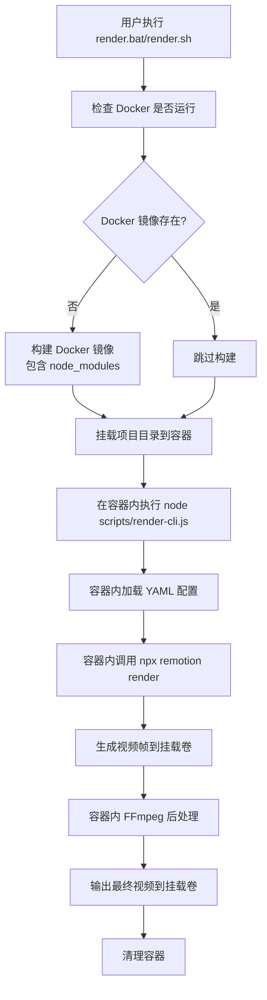
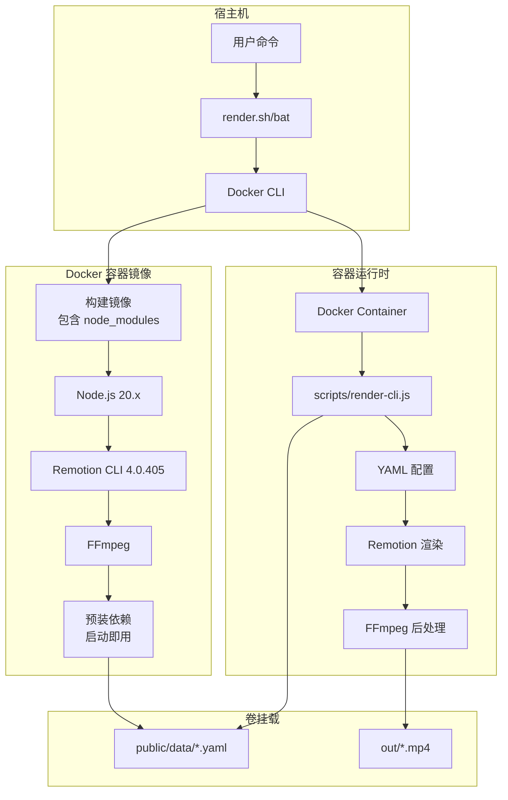
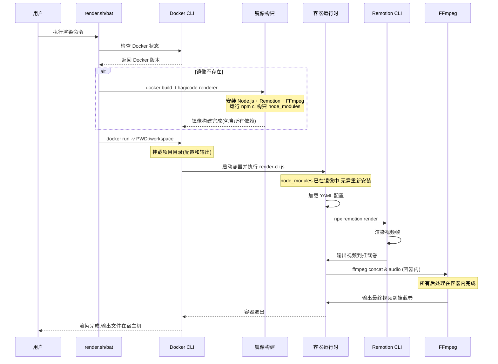

# Change: Docker容器化Remotion渲染环境

## Why

当前项目的 Remotion 视频渲染依赖本地 Node.js 环境和系统依赖(FFmpeg),存在环境配置复杂、跨平台差异大、资源隔离不足等问题。这导致渲染结果在不同操作系统间可能不一致,且难以在 CI/CD 环境中复现相同的渲染条件。

通过 Docker 容器化渲染环境,可以:
- 确保跨平台渲染环境的一致性(Windows/Linux/macOS)
- 简化团队协作中的环境配置成本
- 提供资源隔离,避免渲染任务影响开发环境
- 为未来实现分布式渲染和 CI/CD 集成奠定基础

## What Changes

- **新增 Dockerfile**:定义基于 Node.js 20.x 的渲染环境镜像,包含 Remotion CLI、FFmpeg、项目依赖和预构建的 node_modules
- **新增 docker_entrypoint.sh**:Docker 容器入口脚本,简化命令执行,用户无需指定完整命令
- **新增 .dockerignore**:优化镜像构建上下文,排除不必要的文件(如 .git、out/)
- **更新 render.sh 和 render.bat**:提供基于 Docker 的渲染命令,所有渲染流程在容器内完成
- **新增 docker-compose.yml(可选)**:简化 Docker 容器管理,提供一键渲染体验
- **文档更新**:添加 Docker 渲染使用说明,包括镜像构建、容器运行和故障排查

### 容器优先架构
- 所有渲染流程(包括 FFmpeg 后处理)在容器内完成
- 镜像本地构建,预装所有依赖项和 node_modules
- 容器启动即用,通过 ENTRYPOINT 脚本简化命令执行
- 用户只需传递 YAML 配置文件路径,无需指定完整的 Node.js 命令

## UI Design Changes

不涉及用户界面变更。本项目为命令行工具,仅调整命令行交互方式。

### 命令行使用方式

#### Docker渲染方式(新增)
```bash
# Windows (PowerShell)
.\render.bat data.yaml --output out/video.mp4

# Linux/macOS
./render.sh data.yaml --output out/video.mp4

# 或直接使用 docker 命令(通过 ENTRYPOINT 简化)
docker run --rm -v "${PWD}:/workspace" hagicode-renderer:latest data.yaml

# 完整示例(带参数)
docker run --rm -v "${PWD}:/workspace" hagicode-renderer:latest \
  data.yaml --output out/video.mp4 --verbose
```

## Code Flow Changes

### Docker渲染流程



### 架构设计



### 数据序列列



## Impact

### Affected specs
- **external-rendering**:新增 Docker 容器化渲染能力

### Affected code
- **docker_entrypoint.sh**(新增):容器入口脚本,简化命令执行
- **render.bat**:更新为调用 Docker 命令
- **render.sh**:更新为调用 Docker 命令
- **Dockerfile**(新增):定义渲染环境镜像,设置 ENTRYPOINT
- **.dockerignore**(新增):优化镜像构建
- **docker-compose.yml**(可选):简化容器管理

### 环境依赖变更
- **新增依赖**:
  - Docker Engine 20.10+ 或 Docker Desktop 4.0+
  - (可选) Docker Compose v2
- **移除依赖**:
  - 不再需要本地 Node.js 环境(仅在容器内需要)
  - 不再需要本地 FFmpeg 安装(仅在容器内需要)

### 性能影响
- **优点**:
  - 资源隔离:渲染任务不影响开发环境性能
  - 可复现性:固定镜像版本确保渲染结果一致
  - 并行能力:可同时运行多个容器实例进行批量渲染
  - 预构建依赖:node_modules 已在镜像中,容器启动即用,无需等待依赖安装
- **缺点**:
  - 首次镜像构建时间:约 3-5 分钟(取决于网络速度,但仅一次)
  - 容器启动开销:约 1-2 秒(相比直接运行 Node.js)
  - 磁盘 I/O:卷挂载可能略低于本地文件系统性能

### 迁移路径
1. **阶段 1 - 容器化实施**:创建 Dockerfile 和更新渲染脚本,所有渲染迁移到容器
2. **阶段 2 - 文档完善**:提供完整的 Docker 使用指南和故障排查
3. **阶段 3 - CI/CD 集成**:在 CI 系统中采用 Docker 渲染模式
4. **阶段 4 - 优化迭代**:根据使用反馈优化镜像大小和构建速度

### 风险与缓解
- **风险**:用户未安装 Docker 或 Docker 版本过低
  - **缓解**:在脚本中检测 Docker 可用性,提供清晰的错误提示和安装指引
- **风险**:Windows Docker Desktop 性能或文件共享问题
  - **缓解**:文档说明 WSL2 后端推荐配置,提供故障排查指南
- **风险**:卷挂载路径权限问题(尤其是 Linux/macOS)
  - **缓解**:在文档中说明权限配置,脚本中自动处理常见问题

### 测试计划
- 在 Windows(WSL2 + Docker Desktop)、Linux(Docker Engine)、macOS(Docker Desktop)上验证渲染流程
- 确认镜像构建、容器运行、卷挂载、输出文件完整性
- 验证 node_modules 预构建:容器内无需重新安装依赖
- 验证 FFmpeg 容器内处理:所有后处理在容器内完成
- 性能基准测试:测量镜像构建时间和容器渲染性能
