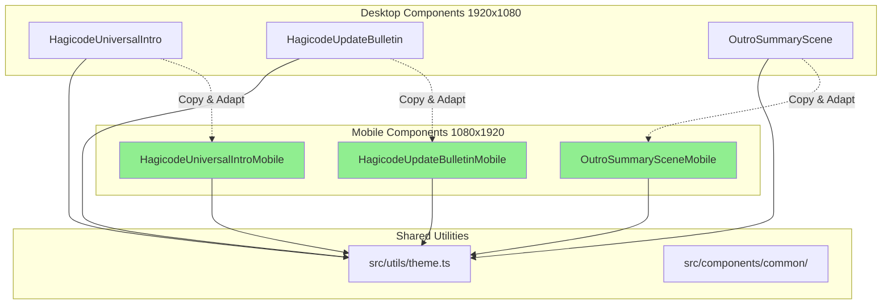
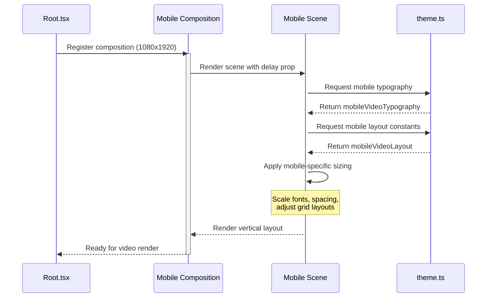

# Design Document: Mobile Video Components

## Context

The Hagicode video project currently supports desktop/landscape video output (1920x1080) optimized for platforms like YouTube and desktop viewing. Mobile-first platforms (Douyin, Bilibili mobile, Xiaohongshu, TikTok) require vertical video formats (1080x1920) for optimal user engagement.

**Constraints**:
- Must maintain visual consistency with desktop versions
- Cannot modify existing desktop components (backward compatibility)
- Mobile components must be independently testable and renderable
- Reuse existing animation patterns and Remotion architecture

**Stakeholders**:
- Hagicode development team - needs mobile video content for marketing
- Social media managers - need vertical videos for mobile platforms
- Video producers - need parallel rendering workflows

## Goals / Non-Goals

**Goals**:
- Create three mobile-optimized video components (1080x1920 vertical)
- Reuse desktop component design patterns with mobile adaptations
- Enable independent rendering of mobile versions
- Maintain visual consistency (colors, gradients, effects, typography style)
- Support the same data-driven capabilities as desktop versions

**Non-Goals**:
- Creating responsive components that work on both resolutions (keep separate)
- Refactoring desktop components to support both orientations
- Creating a universal abstraction layer for multi-resolution support
- Modifying existing desktop video compositions
- Adding platform-specific features (platform filters, stickers, etc.)

## Decisions

### Decision 1: Separate Mobile Components (Not Responsive)

**Choice**: Create separate `*Mobile.tsx` files rather than making existing components responsive.

**Rationale**:
- Video compositions have fixed resolutions (canvas size is part of the composition definition)
- Responsive design is unnecessary for rendered video (not interactive)
- Easier to maintain separate optimization paths for desktop vs mobile
- Avoids complex conditional logic based on canvas orientation
- Allows independent testing and iteration

**Alternatives considered**:
- **Responsive props**: Pass canvas dimensions to components - rejected because over-engineering for fixed video output
- **CSS media queries**: Not applicable in Remotion video rendering (canvas size is fixed per composition)
- **Aspect ratio scaling**: Scale desktop content to fit mobile - rejected because text/UI elements would be too small

### Decision 2: Canvas Resolution - 1080x1920 Vertical

**Choice**: Use 1080x1920 (9:16 portrait) resolution at 60fps.

**Rationale**:
- Standard vertical video resolution for mobile platforms
- Matches typical mobile phone screen aspect ratio
- 60fps ensures smooth animations consistent with desktop versions
- Full HD width (1080px) provides good quality on mobile displays

**Alternatives considered**:
- **720x1280**: Lower resolution, faster rendering - rejected because quality trade-off
- **1920x1920 square**: Compromise format - rejected because doesn't match any platform well
- **30fps instead of 60fps**: Faster rendering - rejected because desktop versions use 60fps

### Decision 3: Layout Adaptations - Single Column Stack

**Choice**: Convert multi-column desktop layouts to single-column stacked layouts for mobile.

**Desktop (1920x1080)**:
- 3-column feature card grids
- Side-by-side content sections
- Horizontal spacing: 60-80px gaps

**Mobile (1080x1920)**:
- 1-column stacked layouts
- Full-width cards and sections
- Vertical spacing: 30-40px gaps

**Rationale**:
- Narrow width (1080px)不适合 multiple columns
- Stacked layout is standard for mobile UI patterns
- Full-width cards maximize use of available space
- Vertical scrolling is natural on mobile devices

**Alternatives considered**:
- **2-column grid**: Possible but cards would be too narrow (~480px each) - rejected
- **Horizontal scrolling**: Not typical for vertical video format - rejected
- **Tabbed interface**: Too complex for short video format - rejected

### Decision 4: Typography Scaling

**Choice**: Scale font sizes larger relative to canvas width for mobile.

**Desktop (1920x1080)**:
- Hero title: 140px (7.3% of canvas width)
- Body text: 52px (2.7% of canvas width)

**Mobile (1080x1920)**:
- Hero title: 140px (13% of canvas width) - larger proportion
- Body text: 48px (4.4% of canvas width) - larger proportion

**Rationale**:
- Mobile videos often viewed on smaller screens (need larger text for readability)
- Narrower canvas requires larger proportional fonts
- Maintains visual hierarchy while ensuring readability
- Follows mobile design best practices (larger touch targets, readable text)

**Alternatives considered**:
- **Keep same absolute sizes**: Text would appear too large on mobile - rejected
- **Scale by canvas width ratio**: Would make text too small - rejected
- **Use responsive font units**: Not applicable to fixed canvas rendering

### Decision 5: Theme Extension Approach

**Choice**: Extend existing `src/utils/theme.ts` with mobile-specific sections.

**Implementation**:
```typescript
// Add to theme.ts:
export const mobileVideoTypography = {
  fontSize: { ... },
  fontWeight: { ... },
  safeZone: { ... },
};

export const mobileVideoLayout = {
  canvas: { width: 1080, height: 1920 },
  safeZone: { horizontal: '60px', vertical: '80px' },
  // ... mobile-specific layout constants
};
```

**Rationale**:
- Single source of truth for design tokens
- Reuses existing color palette and gradients
- Easy to maintain consistency across mobile components
- TypeScript type checking prevents errors

**Alternatives considered**:
- **Separate mobile theme file**: Would duplicate color definitions - rejected
- **Component-level constants**: Harder to maintain consistency - rejected
- **CSS-in-JS with themes**: Overkill for Remotion video rendering - rejected

## Technical Design

### Component Architecture



### File Structure

```
src/
├── utils/
│   └── theme.ts                          # ← Extend with mobileVideoTypography, mobileVideoLayout
│
├── compositions/
│   ├── HagicodeUniversalIntro.tsx        # Desktop (existing)
│   ├── HagicodeUniversalIntroMobile.tsx  # Mobile NEW
│   ├── HagicodeUpdateBulletin.tsx        # Desktop (existing)
│   └── HagicodeUpdateBulletinMobile.tsx  # Mobile NEW
│
├── scenes/
│   ├── intro/                            # Desktop scenes (existing)
│   │   ├── BrandIntroScene.tsx
│   │   ├── SmartControllableScene.tsx
│   │   ├── MultiThreadEfficientScene.tsx
│   │   ├── FunExperienceScene.tsx
│   │   └── OutroSummaryScene.tsx
│   │
│   └── intro-mobile/                     # Mobile scenes NEW
│       ├── BrandIntroSceneMobile.tsx
│       ├── SmartControllableSceneMobile.tsx
│       ├── MultiThreadEfficientSceneMobile.tsx
│       ├── FunExperienceSceneMobile.tsx
│       └── OutroSummarySceneMobile.tsx
│
├── components/
│   ├── intro/                            # Desktop components (existing)
│   │   └── SceneLayout.tsx
│   └── intro-mobile/                     # Mobile components NEW
│       └── SceneLayoutMobile.tsx
│
└── Root.tsx                              # ← Register 3 new mobile compositions
```

### Mobile Composition Data Flow



### Root.tsx Registration Pattern

```typescript
// Add to Root.tsx:

import HagicodeUniversalIntroMobile, {
  DURATION_IN_FRAMES as HAGICODE_UNIVERSAL_INTRO_MOBILE_DURATION
} from "./compositions/HagicodeUniversalIntroMobile";

import HagicodeUpdateBulletinMobile from "./compositions/HagicodeUpdateBulletinMobile";

import { OutroSummarySceneMobile } from "./scenes/intro-mobile/OutroSummarySceneMobile";

export const RemotionRoot: React.FC = () => {
  return (
    <>
      {/* ... existing desktop compositions ... */}

      {/* Mobile compositions - NEW */}
      <Composition
        id="HagicodeUniversalIntroMobile"
        component={HagicodeUniversalIntroMobile}
        durationInFrames={HAGICODE_UNIVERSAL_INTRO_MOBILE_DURATION}
        fps={60}
        width={1080}
        height={1920}
        defaultProps={{}}
      />

      <Composition
        id="HagicodeUpdateBulletinMobile"
        component={HagicodeUpdateBulletinMobile}
        durationInFrames={calculateDuration(defaultData)}
        fps={60}
        width={1080}
        height={1920}
        schema={UpdateBulletinDataSchema}
        defaultProps={defaultData}
      />

      <Composition
        id="HagicodeOutroSummaryMobile"
        component={OutroSummarySceneMobile}
        durationInFrames={60 * 5} // 5 seconds @ 60fps
        fps={60}
        width={1080}
        height={1920}
        defaultProps={{}}
      />
    </>
  );
};
```

### Mobile Layout Adaptations

#### Card Grid: Desktop vs Mobile

**Desktop (3x2 grid)**:
```typescript
// SmartControllableScene.tsx (desktop)
<div style={{
  display: 'grid',
  gridTemplateColumns: 'repeat(3, 1fr)',
  gridTemplateRows: 'repeat(2, 1fr)',
  gap: '36px',
  maxWidth: '1400px',
}}>
```

**Mobile (2x3 grid)**:
```typescript
// SmartControllableSceneMobile.tsx
<div style={{
  display: 'grid',
  gridTemplateColumns: 'repeat(2, 1fr)',  // 2 columns instead of 3
  gridTemplateRows: 'repeat(3, 1fr)',      // 3 rows instead of 2
  gap: '24px',                              // Smaller gap for mobile
  width: '100%',                            // Full width
}}>
```

#### Safe Zones: Desktop vs Mobile

**Desktop (1920x1080)**:
```typescript
safeZone: {
  horizontal: '80px',  // 4% of 1920px
  vertical: '60px',     // 5.5% of 1080px
}
```

**Mobile (1080x1920)**:
```typescript
mobileVideoLayout: {
  safeZone: {
    horizontal: '60px',  // 5.5% of 1080px (narrower)
    vertical: '80px',     // 4% of 1920px (taller)
  }
}
```

## Risks / Trade-offs

### Risk 1: Increased Code Maintenance Burden

**Risk**: Maintaining parallel desktop and mobile components increases maintenance surface area.

**Mitigation**:
- Mobile components are simple copies/adaptations - low complexity
- Shared theme utilities prevent drift
- Clear naming convention (*Mobile suffix) prevents confusion
- Separate evolution paths allow platform-specific optimizations

**Trade-off**: Accept higher file count for clearer separation of concerns.

### Risk 2: Animation Timing Inconsistencies

**Risk**: Animations optimized for 1920x1080 may not translate perfectly to 1080x1920.

**Mitigation**:
- Use frame-based timing (same number of frames, same fps)
- Test all animations in Remotion Studio before production use
- Adjust spring physics and interpolation ranges for mobile layout
- Validate smooth playback on actual mobile devices

**Trade-off**: Some animation fine-tuning required for mobile layouts.

### Risk 3: Text Readability on Smaller Screens

**Risk**: Text sized for 1080px width may be too small when viewed on small mobile screens.

**Mitigation**:
- Use larger proportional fonts (4-5% of canvas width for body text)
- Follow WCAG AAA contrast ratios (already implemented in theme)
- Test on actual mobile devices before finalizing
- Provide minimum font size constraints in theme

**Trade-off**: Larger text reduces content capacity per screen.

### Risk 4: Content Truncation in Vertical Format

**Risk**: Horizontal content (wide charts, tables) may not fit in 1080px width.

**Mitigation**:
- Redesign horizontal layouts as vertical stacks
- Simplify complex charts for mobile (fewer data points)
- Use scrolling lists instead of wide tables
- Test with real content from desktop versions

**Trade-off**: Some content may need simplification for mobile format.

## Migration Plan

### Phase 1: Setup (Day 1)

1. Extend `src/utils/theme.ts` with mobile-specific typography and layout constants
2. Create directory structure: `src/scenes/intro-mobile/`, `src/components/intro-mobile/`
3. Validate theme extensions work correctly

### Phase 2: Mobile Scenes (Days 2-3)

1. Create `BrandIntroSceneMobile.tsx` - Test in Remotion Studio
2. Create `SmartControllableSceneMobile.tsx` - Test card flip animations
3. Create `MultiThreadEfficientSceneMobile.tsx` - Test bar chart layout
4. Create `FunExperienceSceneMobile.tsx` - Test feature card stack
5. Create `OutroSummarySceneMobile.tsx` - Test CTA visibility

### Phase 3: Mobile Compositions (Day 4)

1. Create `HagicodeUniversalIntroMobile.tsx` - Compose all mobile scenes
2. Create `HagicodeUpdateBulletinMobile.tsx` - Adapt data-driven logic
3. Create `HagicodeOutroSummaryMobile.tsx` - Extract standalone composition
4. Register all 3 in `Root.tsx`

### Phase 4: Testing (Day 5)

1. Preview all 3 mobile compositions in Remotion Studio
2. Render sample videos and validate output quality
3. Test on actual mobile devices (if available)
4. Fix any layout or animation issues
5. Run `npm run lint` and fix any code quality issues

### Rollback Plan

If issues arise:
- Mobile components are independent - can be removed without affecting desktop versions
- Simply remove the 3 new `<Composition>` entries from `Root.tsx`
- Delete mobile scene/component files
- No changes to existing desktop code = zero risk to existing functionality

## Open Questions

1. **Q**: Should mobile versions use 30fps or 60fps?
   **A**: 60fps (same as desktop) for consistency and smooth animations

2. **Q**: Should we support horizontal mobile video (1920x1080 for landscape mobile viewing)?
   **A**: Out of scope - vertical format (9:16) is standard for mobile platforms

3. **Q**: Can we share more code between desktop and mobile components?
   **A**: Possible future refactoring, but start with separate files for clarity

4. **Q**: Should mobile versions have different duration/timing than desktop?
   **A**: Keep same duration (12s intro, dynamic update bulletin) for consistency

5. **Q**: How do we handle platform-specific requirements (Douyin vs TikTok vs Bilibili)?
   **A**: Out of scope - focus on universal mobile format first
