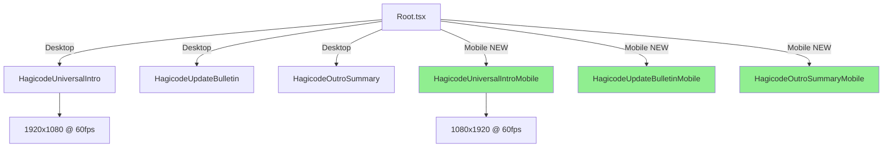
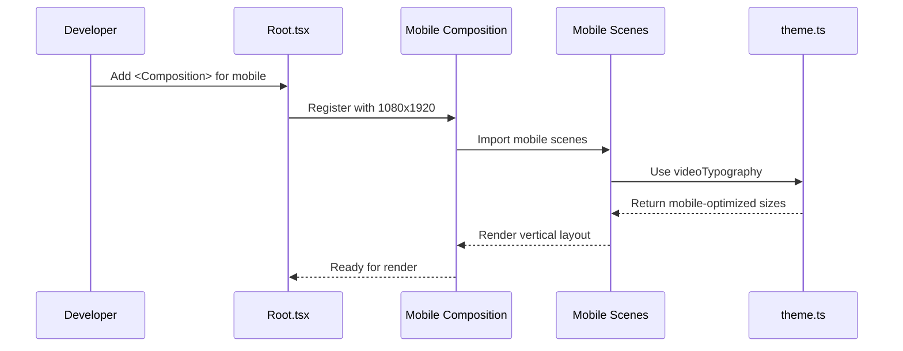

# Change: Add Mobile Version Video Components

## Why

Current Hagicode video components are designed exclusively for desktop/landscape viewing (1920x1080 resolution). Mobile-first platforms like Douyin, Bilibili, and Xiaohongshu require vertical or mobile-optimized video formats for optimal user engagement. The existing desktop components display poorly on mobile devices due to incompatible aspect ratios, text that's too small to read, and UI elements not optimized for small screens.

## What Changes

- **New Mobile Components**: Create three new mobile-specific video components:
  - `HagicodeUniversalIntroMobile` - Mobile-optimized universal intro (1080x1920 vertical)
  - `HagicodeUpdateBulletinMobile` - Mobile-optimized update bulletin (1080x1920 vertical)
  - `HagicodeOutroSummaryMobile` - Mobile-optimized outro summary (1080x1920 vertical)

- **Composition Registration**: Add three new compositions to `Root.tsx` with mobile resolution (1080x1920) at 60fps

- **Mobile Scene Components**: Create mobile-optimized versions of scene components:
  - Mobile versions of intro scenes (BrandIntro, SmartControllable, MultiThreadEfficient, FunExperience)
  - Mobile layouts for update bulletin (header, highlights, minor items)
  - Mobile outro summary with vertical layout

- **Design Adaptations**:
  - Reuse existing desktop component animation logic and design patterns
  - Scale font sizes, spacing, and UI elements for 1080x1920 vertical canvas
  - Adjust grid layouts (3-column desktop → 1-2 column mobile)
  - Optimize safe zones for vertical video (closer crop zones)
  - Maintain visual consistency with desktop versions (colors, gradients, effects)

- **Independent Code Structure**:
  - Mobile components stored in separate files (`*Mobile.tsx`)
  - No modifications to existing desktop components
  - Independent rendering and testing capabilities
  - Separate maintenance path for mobile-specific optimizations

## UI Design Changes

### Mobile Video Layout (1080x1920 Vertical)

```
┌─────────────────┐
│     (40px)      │  ← Top safe zone
├─────────────────┤
│                 │
│   Hero Title    │  ← 140-160px font
│   (Brand)       │
│                 │
├─────────────────┤
│                 │
│  Main Content   │  ← Single column
│  - Cards        │    layout
│  - Lists        │
│  - Features     │
│                 │
│                 │
├─────────────────┤
│                 │
│   CTA / Links   │  ← Bottom section
│                 │
├─────────────────┤
│     (60px)      │  ← Bottom safe zone
└─────────────────┘
```

### Comparison: Desktop vs Mobile Layout

**Desktop (1920x1080)**:
- 3-column grid for feature cards
- Horizontal landscape layouts
- Side-by-side content sections
- Wider spacing (60-80px gaps)

**Mobile (1080x1920)**:
- 1-column stacked layouts
- Vertical scroll-friendly
- Full-width cards
- Tighter spacing (30-40px gaps)
- Larger fonts relative to canvas

### Scene Flow Comparison

**Desktop Universal Intro**:
```
Brand Intro (1s) → Smart Controllable (3s) → Multi-Thread (3s) → Fun Experience (3s) → Outro (2s)
Total: 12 seconds @ 60fps
```

**Mobile Universal Intro** (same duration, adapted layout):
```
Brand Intro (1s) → Smart Controllable (3s) → Multi-Thread (3s) → Fun Experience (3s) → Outro (2s)
Total: 12 seconds @ 60fps
```

## Code Flow Changes

### Component Architecture

```
src/
├── compositions/
│   ├── HagicodeUniversalIntro.tsx          # Desktop (existing)
│   ├── HagicodeUniversalIntroMobile.tsx    # Mobile (NEW)
│   ├── HagicodeUpdateBulletin.tsx          # Desktop (existing)
│   ├── HagicodeUpdateBulletinMobile.tsx    # Mobile (NEW)
│   └── HagicodeOutroSummaryMobile.tsx      # Mobile (NEW, extracted from scene)
│
├── scenes/
│   ├── intro/                              # Desktop scenes (existing)
│   └── intro-mobile/                       # Mobile scenes (NEW)
│       ├── BrandIntroSceneMobile.tsx
│       ├── SmartControllableSceneMobile.tsx
│       ├── MultiThreadEfficientSceneMobile.tsx
│       ├── FunExperienceSceneMobile.tsx
│       └── OutroSummarySceneMobile.tsx
│
├── components/
│   ├── intro/                              # Desktop components (existing)
│   └── intro-mobile/                       # Mobile components (NEW)
│       └── SceneLayoutMobile.tsx
│
└── Root.tsx                                # Register +3 new compositions
```

### Composition Registration Flow



### Mobile Component Implementation Pattern



## Impact

- **Affected specs**:
  - `universal-intro-video` - Adding mobile variant capability
  - `hagicode-update-bulletin` - Adding mobile variant capability
  - New spec needed: `mobile-video-components` - Core mobile video capabilities

- **Affected code**:
  - `src/Root.tsx` - Add 3 new composition registrations (non-breaking)
  - New files: `src/compositions/*Mobile.tsx` (3 files)
  - New files: `src/scenes/intro-mobile/*.tsx` (5 scene files)
  - New files: `src/components/intro-mobile/*.tsx` (1-2 component files)
  - Existing code: **Zero modifications** to desktop components

- **Rendering outputs**:
  - Desktop: 1920x1080 MP4 (existing)
  - Mobile: 1080x1920 MP4 (new, for vertical platforms)

- **Development workflow**:
  - Existing desktop rendering workflow unchanged
  - New mobile videos renderable via `npx remotion render HagicodeUniversalIntroMobile`
  - Independent testing in Remotion Studio

- **Maintenance**:
  - Desktop and mobile versions evolve independently
  - Shared theme utilities from `src/utils/theme.ts`
  - Animation patterns reusable via copy-adapt approach

- **Platform coverage**:
  - Desktop versions: YouTube, website embeds, desktop viewing
  - Mobile versions: Douyin, Bilibili mobile, Xiaohongshu, Instagram Reels, TikTok
