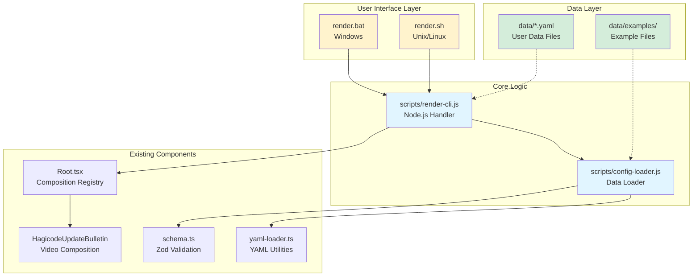
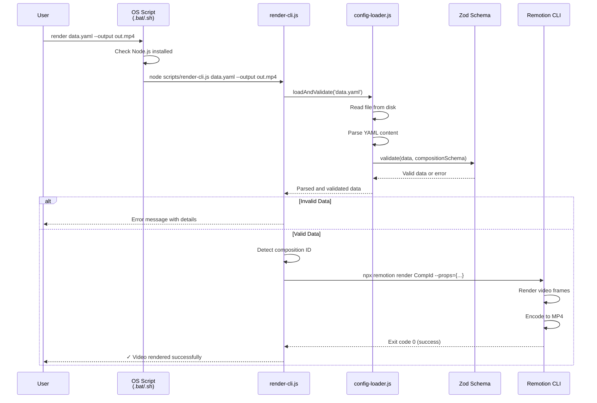

# Design Document: YAML Configuration-Driven Video Rendering

## Context

The Hagicode video project currently uses Remotion 4.0.405 for programmatic video generation. While the existing system works well for developers with access to the codebase, it lacks flexibility for external systems and non-technical users who need to generate video content. This design document outlines the technical approach for adding YAML-based configuration and CLI rendering capabilities.

### Stakeholders
- **Developers**: Need programmatic access to video rendering for automation
- **Content Creators**: Need simple, code-free way to customize video content
- **CI/CD Systems**: Need command-line interface for automated video generation
- **External Systems**: Need API-like interface to trigger video rendering

### Constraints
- Must maintain backward compatibility with existing Remotion Studio workflow
- Must use existing Zod schemas for validation consistency
- Must work within Remotion 4.0.405 API limitations
- Must handle errors gracefully with clear user feedback

## Goals / Non-Goals

### Goals
- ✅ Enable video rendering via CLI with YAML configuration files
- ✅ Support all existing composition types (HagicodeUpdateBulletin, HagicodeUniversalIntro, etc.)
- ✅ Provide clear error messages for configuration issues
- ✅ Create reusable YAML templates for common video types
- ✅ Maintain shared validation logic between CLI and Remotion Studio

### Non-Goals
- ❌ Building a web API or REST service (future enhancement)
- ❌ Creating a GUI for video configuration (use Remotion Studio)
- ❌ Supporting real-time preview in CLI (use Remotion Studio)
- ❌ Replacing existing composition development workflow
- ❌ Adding new video composition types (use existing change proposals)

## Decisions

### Decision 1: OS-Specific Entry Scripts

**Choice**: Use OS-specific entry scripts (`render.bat` for Windows, `render.sh` for Unix/Linux) that delegate to a shared Node.js handler.

**Rationale**:
- **User Experience**: Users run native scripts familiar to their OS without needing Node.js knowledge
- **Cross-Platform**: Single Node.js handler works on all platforms, OS scripts only handle path conversion
- **Simplicity**: Entry scripts are minimal (10-20 lines), complex logic in JavaScript
- **Portability**: Scripts can be called from any automation tool or CI/CD system

**Alternatives Considered**:
1. **Single Node.js script only**: Requires users to know `node script.js` syntax, less user-friendly
2. **Remotion Lambda**: Too complex, requires AWS infrastructure, overkill for local rendering
3. **Custom Express API**: Adds web server complexity, not needed for current requirements

**Implementation**:

**Windows Entry (render.bat)**:
```batch
@echo off
REM Hagicode Video Renderer - Windows Entry Point

REM Check if Node.js is installed
where node >nul 2>&1
if %ERRORLEVEL% NEQ 0 (
    echo Error: Node.js is not installed or not in PATH
    echo Please install Node.js from https://nodejs.org/
    exit /b 1
)

REM Convert Windows paths and invoke Node.js handler
node scripts/render-cli.js %*

exit /b %ERRORLEVEL%
```

**Unix/Linux Entry (render.sh)**:
```bash
#!/bin/bash
# Hagicode Video Renderer - Unix/Linux Entry Point

# Check if Node.js is installed
if ! command -v node &> /dev/null; then
    echo "Error: Node.js is not installed or not in PATH"
    echo "Please install Node.js from https://nodejs.org/"
    exit 1
fi

# Invoke Node.js handler
node scripts/render-cli.js "$@"

# Exit with Node.js handler's exit code
exit $?
```

### Decision 2: YAML Data File Structure

**Choice**: Use YAML files containing only video content data (composition-specific fields), not technical configuration like output format or codec.

**Rationale**:
- **Simplicity**: Data files focus on content (text, images, timing), not technical settings
- **Reuse**: Leverage existing composition schemas directly without wrapper layer
- **Validation**: Use existing Zod schemas as-is, no new schema maintenance burden
- **Flexibility**: Technical settings (output path, codec) can be passed via CLI arguments

**Schema Approach**:
- Data files contain ONLY the data that matches a composition's props interface
- Composition ID is determined by file location or naming convention, or passed via CLI
- Output settings (path, format, quality) are CLI arguments, not in YAML

**YAML Data File Examples**:

**Update Bulletin Data (data/update-v1.2.0.yaml)**:
```yaml
# Hagicode Update Bulletin - Version 1.2.0
# This file contains the video content data for the update bulletin

version: "v1.2.0"
releaseDate: "2026-01-18"
summary: "This update includes new AI features and bug fixes."

highlights:
  - id: "feature-1"
    title: "AI Code Generation"
    description: "Generate code with Claude AI integration"
    screenshot: "/public/images/ai-feature.png"
    tags: [feature, ai]

  - id: "bugfix-1"
    title: "Memory Leak Fixed"
    description: "Fixed memory leak in background processing"
    tags: [bugfix, performance]

minorItems:
  - category: feature
    title: "Added dark mode"

  - category: bugfix
    title: "Fixed login issue"
    description: "Users can now login with special characters"
```

**Usage**:
```bash
# Windows
render.bat data/update-v1.2.0.yaml --output out/update-v1.2.0.mp4

# Unix/Linux
./render.sh data/update-v1.2.0.yaml --output out/update-v1.2.0.mp4
```

### Decision 3: Remotion CLI Integration Strategy

**Choice**: Use child process to spawn `npx remotion render` command.

**Rationale**:
- **Stability**: Uses official Remotion CLI, tested by Remotion team
- **Features**: Access to all Remotion rendering features (parallel rendering, codec options)
- **Compatibility**: Works with bundled and non-bundled projects
- **Simplicity**: No need to understand Remotion's internal Node.js API

**Alternatives Considered**:
1. **Remotion Node.js API**: Less documented, changes between versions, harder to debug
2. **Direct FFMPEG invocation**: Loses Remotion optimizations, complex to implement

**Implementation**:
```javascript
// scripts/render-cli.js structure
const fs = require('fs');
const path = require('path');
const { spawn } = require('child_process');
const yaml = require('js-yaml');
const chalk = require('chalk');

// Parse command-line arguments
const args = process.argv.slice(2);
if (args.length === 0) {
  console.error(chalk.red('Error: Missing data file argument'));
  console.log(chalk.cyan('Usage: render <data-file.yaml> [options]'));
  console.log(chalk.cyan('Options:'));
  console.log(chalk.cyan('  --output <path>    Output video path (default: out/video.mp4)'));
  console.log(chalk.cyan('  --composition <id> Override composition ID'));
  console.log(chalk.cyan('  --verbose          Enable detailed logging'));
  process.exit(1);
}

// Extract arguments
const dataFile = args[0];
const outputPath = args.includes('--output') ? args[args.indexOf('--output') + 1] : 'out/video.mp4';
const compositionId = args.includes('--composition') ? args[args.indexOf('--composition') + 1] : null;
const verbose = args.includes('--verbose');

// Load and validate data file
async function renderVideo(dataFilePath, options) {
  try {
    // Read YAML file
    const yamlContent = fs.readFileSync(dataFilePath, 'utf8');
    const data = yaml.load(yamlContent);

    // Validate against schema (would need to import from compiled schema)
    const compositionId = options.composition || detectCompositionFromData(data);

    console.log(chalk.green('✓ Data file loaded successfully'));
    console.log(chalk.gray(`Composition: ${compositionId}`));

    // Build Remotion CLI arguments
    const remotionArgs = [
      'render',
      compositionId,
      `--props=${JSON.stringify(data)}`,
      `--output=${options.output}`,
      '--overwrite',
    ];

    if (options.verbose) {
      console.log(chalk.gray('Invoking Remotion CLI...'));
    }

    // Spawn Remotion CLI process
    const child = spawn('npx', ['remotion', ...remotionArgs], {
      stdio: options.verbose ? 'inherit' : 'pipe',
    });

    // Wait for completion
    await new Promise((resolve, reject) => {
      child.on('close', (code) => {
        if (code === 0) {
          console.log(chalk.green('✓ Video rendered successfully'));
          console.log(chalk.gray(`Output: ${options.output}`));
          resolve(code);
        } else {
          console.error(chalk.red(`✗ Render failed with exit code ${code}`));
          reject(new Error(`Render failed with code ${code}`));
        }
      });
    });

  } catch (error) {
    console.error(chalk.red('✗ Error:'), error.message);
    process.exit(1);
  }
}

renderVideo(dataFile, { output: outputPath, composition: compositionId, verbose });
```

### Decision 4: Error Handling Strategy

**Choice**: Multi-layer error handling with user-friendly messages.

**Error Categories**:
1. **File System Errors**: Missing files, permission issues
2. **YAML Parse Errors**: Syntax errors, malformed YAML
3. **Schema Validation Errors**: Missing required fields, wrong types
4. **Remotion Render Errors**: Composition not found, render failures

**Implementation**:
```typescript
class RenderError extends Error {
  constructor(message: string, public readonly code: string, public readonly cause?: Error) {
    super(message);
    this.name = 'RenderError';
  }
}

// Error handling in CLI
try {
  await renderVideo(configPath, options);
  console.log('✅ Video rendered successfully!');
} catch (error) {
  if (error instanceof YamlParseError) {
    console.error('❌ YAML Parse Error:', error.message);
    console.error('  Check your YAML syntax at:', configPath);
  } else if (error instanceof ZodError) {
    console.error('❌ Validation Error:');
    error.errors.forEach((err) => {
      console.error(`  - ${err.path.join('.')}: ${err.message}`);
    });
  } else if (error instanceof RenderError) {
    console.error(`❌ Render Error [${error.code}]:`, error.message);
  } else {
    console.error('❌ Unknown Error:', error.message);
  }
  process.exit(1);
}
```

### Decision 5: Directory Structure

**Choice**: Organize files by purpose with clear separation between user data, scripts, and existing code.

**Directory Structure**:
```
project-root/
├── render.bat                    # Windows entry script
├── render.sh                     # Unix/Linux entry script
├── scripts/                      # Node.js handler modules
│   ├── render-cli.js            # Main rendering handler
│   └── config-loader.js         # Data file loader and validator
├── data/                         # User video data files
│   ├── examples/                # Example data files
│   │   ├── update-bulletin.yaml
│   │   ├── universal-intro.yaml
│   │   └── README.md
│   ├── update-v1.2.0.yaml       # User's actual data files
│   └── update-v1.1.0.yaml
├── src/                          # Existing source code
│   ├── compositions/            # Remotion compositions
│   │   ├── schema.ts           # Zod schemas (reused)
│   │   └── ...
│   └── utils/
│       └── yaml-loader.ts      # Existing YAML utilities
└── out/                         # Default output directory for videos
```

**Template Documentation**:
```yaml
# templates/update-bulletin.yaml
# Hagicode Update Bulletin Video Template
#
# Usage:
#   node render-video.js --config=templates/update-bulletin.yaml
#
# Configuration Guide:
#   - metadata.composition: Must be "HagicodeUpdateBulletin"
#   - metadata.title: Optional title for logging/identification
#   - data.version: Version string (e.g., "v1.2.0" or "1.2.0-beta")
#   - data.releaseDate: Release date in YYYY-MM-DD format
#   - data.highlights: Array of major updates (max 20)
#   - data.minorItems: Array of minor updates (max 20)
#
# See templates/README.md for complete field reference.

metadata:
  composition: HagicodeUpdateBulletin
  title: "Example Update Bulletin"

data:
  version: "v1.2.0"
  releaseDate: "2026-01-18"
  summary: "This update includes new AI features and bug fixes."

  highlights:
    - id: "feature-1"
      title: "AI Code Generation"
      description: "Generate code with Claude AI integration"
      screenshot: "/images/ai-feature.png"  # Optional
      tags: [feature, ai]

    - id: "bugfix-1"
      title: "Memory Leak Fixed"
      description: "Fixed memory leak in background processing"
      tags: [bugfix, performance]

  minorItems:
    - category: feature
      title: "Added dark mode"

    - category: bugfix
      title: "Fixed login issue"
      description: "Users can now login with special characters"

output:
  format: mp4
  path: "./videos/update-bulletin.mp4"
```

## Technical Design

### Architecture Diagram



### Data Flow Diagram



### Module Structure

```
scripts/
├── render-cli.js              # Main Node.js handler (entry point)
├── config-loader.js           # Data file loading and validation
└── utils/
    └── path-helper.js         # Cross-platform path utilities (optional)
```

### Integration Points

**With Existing `yaml-loader.ts`**:
- Reuse `parseYamlContent()` for parsing
- Reuse `YamlParseError`, `DataLoadError`, `DataValidationError` error classes
- Reuse `validatePath()` for security validation

**With Existing `schema.ts`**:
- Import `UpdateBulletinDataSchema` for validation
- Export composition-specific schemas for CLI use
- Extend schemas if needed for external configuration

**With `Root.tsx`**:
- No changes required - CLI uses composition IDs to target existing compositions
- Shared schemas ensure consistency between CLI and Remotion Studio

## Risks / Trade-offs

### Risk 1: Schema Drift Between CLI and Compositions

**Risk Level**: Medium

**Description**: YAML schemas may diverge from actual composition props if not kept in sync.

**Mitigation**:
- Use shared Zod schemas between CLI and Remotion compositions
- Add CI check to validate schema consistency
- Document schema maintenance responsibilities

**Trade-off**: More upfront effort to design reusable schemas, but prevents bugs long-term.

### Risk 2: Remotion API Changes Breaking CLI

**Risk Level**: Low

**Description**: Future Remotion versions may change CLI arguments or programmatic API.

**Mitigation**:
- Pin Remotion version in package.json (currently 4.0.405)
- Document Remotion version compatibility in README
- Use stable CLI flags (composition, props, output) unlikely to change

**Trade-off**: May need to update CLI code when upgrading Remotion, but infrequent.

### Risk 3: Path Traversal Security Vulnerability

**Risk Level**: Low

**Description**: Malicious config file paths could access files outside project directory.

**Mitigation**:
- Reuse existing `validatePath()` function from `yaml-loader.ts`
- Restrict config file locations to specific directories
- Add tests for path traversal attempts

**Trade-off**: Minimal overhead for significant security improvement.

### Risk 4: Performance with Large Configurations

**Risk Level**: Low

**Description**: Large YAML files or complex schemas could slow down loading.

**Mitigation**:
- Implement caching in `config-loader.ts` (reuse existing cache in `yaml-loader.ts`)
- Set reasonable limits on array sizes (already enforced in schemas)
- Profile with max-size configurations (20 highlights, 20 minor items)

**Trade-off**: Small memory overhead for faster repeated loads.

## Migration Plan

### Phase 1: Core Implementation (Week 1)
- Create `src/cli/` module structure
- Implement `config-loader.ts` with YAML parsing
- Create basic `render-video.js` script
- Test with existing `HagicodeUpdateBulletin` composition

### Phase 2: Template System (Week 1-2)
- Create `templates/` directory
- Write YAML template examples with documentation
- Test templates with CLI script
- Validate error handling with invalid configs

### Phase 3: Polish & Documentation (Week 2)
- Add colored console output with `chalk`
- Write comprehensive README-CLI-RENDERING.md
- Add JSDoc comments to all modules
- Test in clean environment (fresh `npm install`)

### Phase 4: Optional Enhancements (Future)
- Add batch rendering support
- Create shell completion scripts
- Add support for custom codec options
- Implement progress bar for long renders

### Rollback Plan

If CLI rendering causes issues:
1. Existing Remotion Studio workflow remains fully functional
2. Delete `render-video.js` and `src/cli/` directory
3. Remove CLI script from `package.json`
4. No changes to existing compositions or schemas needed

**Zero Breaking Changes**: CLI rendering is purely additive.

## Open Questions

### Q1: Should we support JSON configuration files in addition to YAML?

**Status**: Open

**Rationale**: JSON is simpler for programmatic generation, but YAML is more human-friendly.

**Options**:
1. **YAML only** (simpler, recommended for v1)
2. **Support both YAML and JSON** (more flexible, more maintenance)
3. **Use YAML with JSON import** (use `js-yaml`'s JSON support)

**Recommendation**: Start with YAML only (option 1), add JSON support if requested by users.

### Q2: Should we provide a programmatic Node.js API in addition to CLI?

**Status**: Open

**Rationale**: Some users may want to import rendering functions directly in Node.js scripts.

**Options**:
1. **CLI only** (simpler, current scope)
2. **Export functions from src/cli/** (allows both CLI and programmatic use)
3. **Create separate npm package** (overkill for current needs)

**Recommendation**: Export functions from `src/cli/` (option 2) with minimal extra effort.

### Q3: How should we handle composition-specific duration calculation?

**Status**: Resolved

**Rationale**: Different compositions have different duration calculation logic.

**Solution**: Each composition exports a `calculateDuration(data)` function. CLI calls this function based on composition ID.

```typescript
// In config-loader.ts
function calculateDuration(compositionId: string, data: unknown): number {
  switch (compositionId) {
    case 'HagicodeUpdateBulletin':
      return calculateUpdateBulletinDuration(data);
    case 'HagicodeUniversalIntro':
      return HAGICODE_UNIVERSAL_INTRO_DURATION;
    default:
      throw new Error(`Unknown composition: ${compositionId}`);
  }
}
```

### Q4: Should we support concurrent rendering of multiple videos?

**Status**: Deferred

**Rationale**: Batch rendering could be useful for generating multiple update videos.

**Options**:
1. **Sequential only** (simpler, current scope)
2. **Concurrent with worker pool** (faster, more complex)
3. **User-controlled with `--parallel` flag** (flexible, moderate complexity)

**Recommendation**: Start with sequential (option 1), add concurrency if needed in future enhancement.

## Performance Considerations

### Expected Performance
- **Config Loading**: <100ms for typical YAML files (parsing + validation)
- **Render Startup**: 2-3 seconds for Remotion CLI initialization
- **Video Encoding**: Depends on video length and codec (typically 1-2x real-time)

### Optimization Strategies
1. **Cache Parsed Configs**: Avoid re-parsing same YAML file in development
2. **Parallelize Validation**: Schema validation could be parallelized for large configs
3. **Lazy Load Templates**: Only load templates when explicitly requested
4. **Minimize Dependencies**: Keep CLI dependencies minimal for fast startup

### Monitoring
- Log config loading time in verbose mode
- Track render start/completion times
- Report memory usage if available (Node.js `process.memoryUsage()`)

## Security Considerations

### Input Validation
1. **Path Traversal**: Validate all file paths with `validatePath()`
2. **YAML Injection**: Use `FAILSAFE_SCHEMA` to prevent code execution
3. **Schema Validation**: Enforce type safety with Zod schemas
4. **Command Injection**: Use proper array arguments for child process (no shell interpolation)

### Resource Limits
1. **File Size**: Warn on YAML files >100KB
2. **Array Limits**: Enforce max 20 items per array (already in schemas)
3. **Render Timeout**: Optional flag to kill renders after N minutes

### Access Control
1. **File Permissions**: Check read access to config files
2. **Output Directory**: Ensure write access to output path
3. **Network Access**: No network access needed for local rendering

## Testing Strategy

### Unit Tests (if Jest/Vitest available)
- Test `config-loader.ts` with valid/invalid YAML
- Test schema validation with edge cases
- Test error handling for each error type
- Test path validation security

### Integration Tests
- Test full CLI workflow with real YAML files
- Test rendering with actual video output
- Test error messages with invalid configs
- Test with all composition types

### Manual Testing
- Test with templates/examples
- Test error scenarios (missing file, bad YAML, invalid schema)
- Test verbose vs non-verbose output
- Test custom output paths

### Test Coverage Goals
- Config loading: 90%+ coverage
- Error handling: 100% coverage (all error paths)
- CLI argument parsing: 80%+ coverage

## Documentation Plan

### User Documentation
1. **README-CLI-RENDERING.md** (comprehensive guide)
   - Installation and setup
   - Basic usage examples
   - Command-line flag reference
   - Configuration format reference
   - Troubleshooting guide

2. **Template README** (templates/README.md)
   - Overview of available templates
   - How to use templates
   - How to create custom templates
   - Field reference for each template

3. **Inline Documentation**
   - JSDoc comments in TypeScript files
   - YAML file comments with examples
   - Code examples in README files

### Developer Documentation
1. **Architecture Diagrams** (this design.md)
2. **API Documentation** (JSDoc generated docs)
3. **Contribution Guide** (how to extend CLI, add templates)

### Maintenance Documentation
1. **Schema Maintenance** (how to update schemas)
2. **Template Maintenance** (how to add/update templates)
3. **Troubleshooting** (common issues and solutions)

## Success Criteria

### Functional Requirements
- ✅ CLI script accepts `--config` flag with YAML file path
- ✅ YAML config is validated against Zod schema
- ✅ Remotion CLI is invoked with correct props
- ✅ Video renders successfully to specified output path
- ✅ Clear error messages for invalid configurations

### Non-Functional Requirements
- ✅ Config loading completes in <100ms
- ✅ Error handling covers all failure modes
- ✅ Code follows existing project conventions
- ✅ No breaking changes to existing workflows
- ✅ Documentation enables non-developers to use CLI

### Validation Checklist
- [ ] Test with valid YAML configuration
- [ ] Test with invalid YAML syntax
- [ ] Test with schema violations (missing fields, wrong types)
- [ ] Test with missing configuration file
- [ ] Test with all composition types
- [ ] Test custom output paths
- [ ] Test verbose vs quiet output
- [ ] Test in clean environment (fresh install)
- [ ] Documentation reviewed for clarity
- [ ] Code passes lint and TypeScript checks
