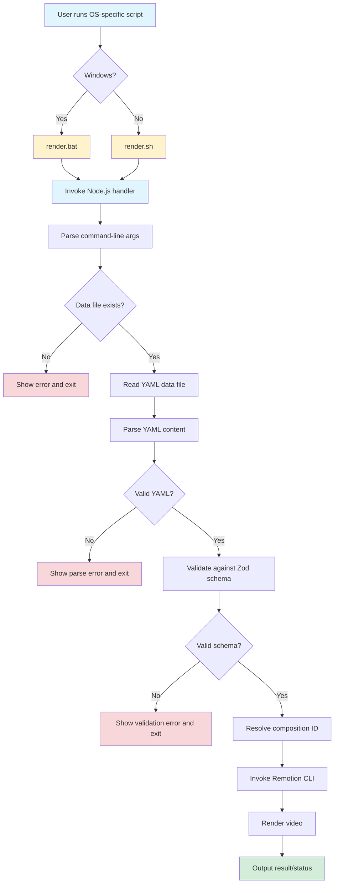
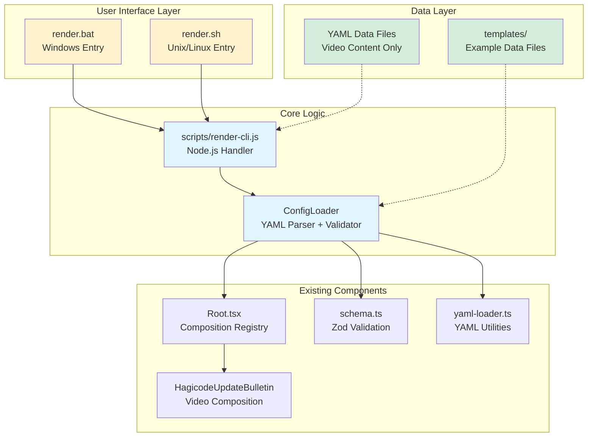

# Change: YAML Configuration-Driven Video Rendering System

## Why

The current Hagicode video rendering system requires hardcoding configuration values directly in source code, making it difficult to create multiple video variations without modifying and redeploying the codebase. This limits flexibility for:
- Non-developers who need to create custom video content
- CI/CD pipelines that need to generate videos dynamically
- External systems that want to integrate video generation capabilities

## What Changes

- **Add OS-specific CLI entry points**: Create `render.bat` (Windows) and `render.sh` (Unix/Linux) as user-friendly interfaces
- **Implement internal Node.js handler**: Create `scripts/render-cli.js` for cross-platform rendering logic
- **YAML data file support**: Pass rendering configuration through YAML data files (not full video configuration)
- **Reuse existing Zod schemas**: Leverage current validation infrastructure for data file parsing
- **Add template data files**: Create example YAML data files for common video scenarios
- **Add configuration validation**: Provide clear error messages when YAML data is invalid

## Code Flow Changes

## Architecture Changes

## Impact

### Affected Specs
- **NEW**: `external-rendering` - External video rendering via CLI and YAML configuration

### Affected Code
- **NEW**: `render.bat` - Windows batch script entry point
- **NEW**: `render.sh` - Unix/Linux shell script entry point
- **NEW**: `scripts/render-cli.js` - Cross-platform Node.js rendering handler
- **NEW**: `scripts/config-loader.js` - Data file parsing and validation module
- **NEW**: `data/` - YAML data file directory for video content
- **NEW**: `data/examples/` - Example YAML data files for common scenarios
- **MODIFY**: `src/compositions/schema.ts` - Reuse existing schemas for data validation

### Benefits
- **OS-Native Interface**: Users run native scripts (.bat on Windows, .sh on Unix) without Node.js knowledge
- **Data-Driven**: YAML files contain only video content data, not technical configuration
- **Cross-Platform**: Single Node.js handler works across all operating systems
- **Accessibility**: Non-developers can edit YAML data files for video content
- **Automation**: CI/CD pipelines can generate videos via script execution
- **Separation of Concerns**: Data (YAML) separated from logic (Node.js handler)

### Risks
- **Schema Drift**: YAML data schemas may diverge from actual composition props
  - **Mitigation**: Reuse existing Zod schemas, add validation tests
- **Script Compatibility**: .bat and .sh scripts must handle paths correctly on different OSes
  - **Mitigation**: Thorough testing on Windows, Linux, macOS; use Node.js for path handling
- **File Access**: Scripts need proper file system permissions
  - **Mitigation**: Add error handling for permission issues, document requirements
- **Remotion API Changes**: Future Remotion versions may change CLI interface
  - **Mitigation**: Pin Remotion version, document compatibility requirements

### Migration Path
- **Phase 1**: Implement OS-specific entry scripts and Node.js handler with basic YAML data support
- **Phase 2**: Create example data files and documentation
- **Phase 3**: Add advanced features (multiple compositions, batch rendering)
- **Rollback**: Existing Remotion Studio workflow remains unchanged, no breaking changes

### Backward Compatibility
- ✅ **No breaking changes** - Existing compositions and workflows unchanged
- ✅ **Optional feature** - CLI rendering is additive, not replacing Remotion Studio
- ✅ **Shared schemas** - Both workflows use same Zod validation
